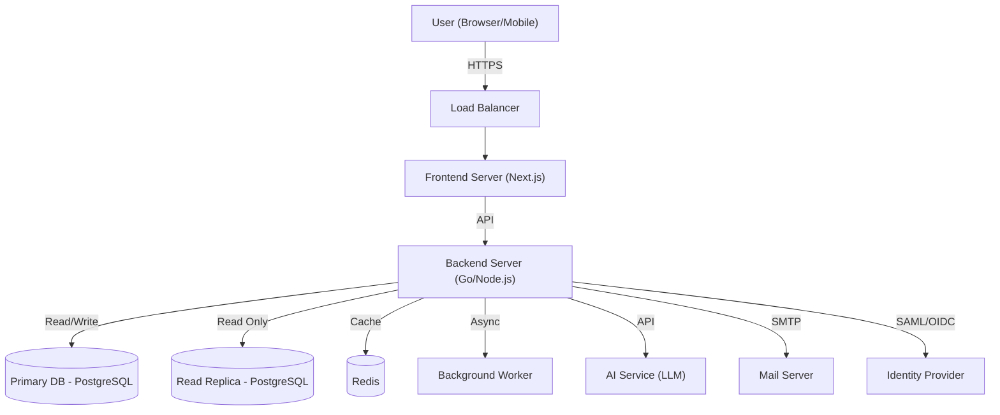
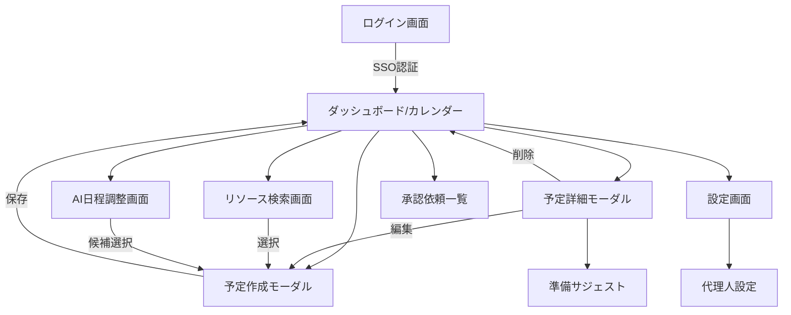

<!--
Depends On: docs/ieee830.md
Depended On By: docs/detailed/01_auth_security.md, docs/detailed/02_schedule_resource.md, docs/detailed/03_ai_assistant.md, docs/detailed/04_collaboration.md, docs/detailed/05_common_infra.md, docs/detailed/06_test_cases.md
-->
# 基本設計書 (Basic Design Document)

| 項目 | 内容 |
| :--- | :--- |
| **プロジェクト名称** | 企業向け次世代統合スケジュール管理システム |
| **文書バージョン** | 1.0.0 |
| **作成日** | 2025年11月23日 |
| **対象システム** | Enterprise Schedule Management System (ESMS) |

## 1. はじめに

### 1.1 目的
本文書は、ソフトウェア要求仕様書 (SRS) に基づき、Enterprise Schedule Management System (ESMS) の基本設計（アーキテクチャ、機能、データ、インターフェース、セキュリティ）を定義するものである。

### 1.2 適用範囲
本設計は、ESMSのWebアプリケーション全体、および関連するバッチ処理、外部連携インターフェースを対象とする。

## 2. システムアーキテクチャ

### 2.1 論理アーキテクチャ構成
本システムは、クライアントサイドレンダリング (CSR) とサーバーサイドレンダリング (SSR) を組み合わせたWebアプリケーションとして構成する。



### 2.2 技術スタック
| レイヤー | 技術要素 | 選定理由 |
| :--- | :--- | :--- |
| **Frontend** | React, Next.js, TypeScript | 高速なレンダリング、SEO対策（社内検索）、型安全性による品質確保。 |
| **Backend** | Go (Golang) | 高い並行処理性能（goroutine）、静的型付け、コンパイル言語による堅牢性。 |
| **Database** | PostgreSQL | 複雑なリレーション（多対多）とトランザクション処理への信頼性。 |
| **Cache** | Redis | セッション管理、頻繁なデータアクセスの高速化。 |
| **AI (Future)** | External LLM API (e.g., Gemini, OpenAI) | 自然言語処理による日程調整機能の実現（将来実装）。 |

### 2.3 非機能指標 (SLA/SLO/負荷前提)
*   **想定負荷:** アクティブユーザー 10,000人、ピーク同時接続 2,000、1日あたり予約作成 80,000件、通知配信 150,000件、LLM呼び出し 20,000回。
*   **目標SLO:**
    - 予約作成・更新 API p95 レイテンシ 400ms 以下、成功率 99.5% 以上。
    - ダッシュボード初期表示 p95 1.5s 以下。
    - (Future) AI日程調整応答 p95 6s 以下（LLM応答を含む）。
*   **可用性/SLA:** 月間 99.9% 稼働。主要メンテナンスは事前告知の上、SLA 除外。
*   **バックアップ/RPO/RTO:** DB Point-in-Time Recovery、RPO 5分、RTO 30分。オブジェクトストレージへの監査ログ定期転送。
*   **スケール戦略:** 予約作成後 60秒間は読み取りをプライマリにスティッキーさせ、レプリカ遅延は 500ms 以内を監視。Redis キャッシュは TTL 5〜15分で非同期無効化を行い、整合性を優先する経路ではキャッシュバイパス。

### 2.4 バックグラウンドジョブ/可観測性
*   **ジョブ種別:** 通知送信（メール/チャット、リトライ3回・指数バックオフ）、未チェックイン予約の自動解放、承認リマインダ、(Future) AIバッチ（要約/レコメンドの事前生成）、エクスポート/バックアップ転送。冪等性キーは予約ID＋ジョブ種別で管理し、3回失敗でデッドレターへ送る。
*   **可観測性:** OpenTelemetry によるトレース/メトリクス/ログ収集。主要メトリクスは予約作成成功率、API p95/p99、ジョブ失敗率、レプリカレイテンシ、(Future) LLM呼び出し成功率・平均コスト。ダッシュボードでSLO違反をアラート。
*   **(Future) AIフォールバック:** LLM呼び出しはタイムアウト 4s、1分間 200 回のレートリミット。失敗時は「AI候補なし」で空き時間検索のみを返却し、プロンプト入力を安全に破棄。過去成功結果の15分キャッシュを再利用。

## 3. 機能設計

### 3.1 機能一覧
SRSの機能要件に基づき、以下の機能を実装する。

| 機能ID | 機能名称 | 概要 | 対応SRS |
| :--- | :--- | :--- | :--- |
| **FN-01** | 認証・認可 | SSO (SAML/OIDC) によるログイン、ロールベースアクセス制御 (RBAC)。 | REQ-04, REQ-SEC1 |
| **FN-02** | 予定管理 | 予定の作成、参照、更新、削除 (CRUD)。繰り返し予定対応。 | REQ-01, REQ-03 |
| **FN-03** | リソース予約 | 会議室、備品の検索と予約。重複チェック（排他制御）。 | REQ-01, REQ-02, REQ-07 |
| **FN-04** | AI日程調整 (Future) | 自然言語による日程調整（将来実装）。 | |
| **FN-05** | 代理操作 | 秘書等による代理予約・編集。 | |
| **FN-06** | 外部連携 | 社外ゲストへの招待状送付、参加可否連携。 | |
| **FN-07** | チェックイン | 会議室の利用開始確認・自動キャンセル。 | |
| **FN-08** | 通知 | 予約作成・変更・リマインドの通知（メール/チャット）。 | |
| **FN-09** | 会議準備支援 (Future) | 議事録・テンプレートのレコメンド（将来実装）。 | REQ-10 |
| **FN-10** | 承認ワークフロー | 重要会議の上長承認プロセス。 | REQ-11 |
| **FN-11** | キャンセルポリシー | 直前キャンセルの警告とペナルティ記録。 | REQ-12 |

### 3.2 重要ロジック設計

#### 3.2.1 排他制御 (Conflict Resolution)
*   **戦略:** 楽観的ロックではなく、データベースの制約またはトランザクション内でのロック（`SELECT FOR UPDATE` 等）を用いた悲観的ロックに近いアプローチを採用し、物理的なダブルブッキングを確実に防ぐ。
*   **フロー:**
    1.  トランザクション開始
    2.  対象リソース・時間帯の既存予約をロック付きで検索
    3.  重複があればロールバック＆エラー返却
    4.  重複がなければ予約レコード挿入
    5.  コミット

#### 3.2.2 繰り返し予定の展開
*   **戦略:** 繰り返しルール（RRULE）を保持しつつ、検索性能向上のため、直近（例：3年分）の予定インスタンスを実データとして展開する、または検索時に動的に展開するハイブリッド方式を検討する。
*   **変更時:** 「以降すべて変更」の場合は、既存の将来インスタンスを削除し、新たなルールで再生成する。

### 3.3 ワークフロー詳細
*   **承認ワークフロー:** 参加者5名超かつ役員が含まれる場合は承認必須。状態は `Draft -> Pending -> Approved/Rejected/Timeout`。`Pending` 48時間でタイムアウトし自動キャンセル、24時間時点でリマインド通知。
*   **キャンセルポリシー:** 予定開始24時間前以降のキャンセルでペナルティスコア＋1（90日ローテーション）。スコア3以上でハイリスク通知を管理者へ送付、5以上で当人の新規予約を制限（承認必須化）。
*   **通知戦略:** テンプレートをチャネル別に管理（メール、社内チャット）。通知はジョブキュー経由で最大3回リトライし、7日間はサプレッションキー（予約ID＋テンプレート）で重複送信を防止。
*   **(Future) AI日程調整セキュリティ:** プロンプト送信前に参加者メール・電話番号をマスキング。組織外ユーザーは候補スロットのみ提示し、詳細情報は返さない。利用ログには要求IDとトークナイズドのプロンプト長のみを記録し、本文は保存しない。

## 4. データ設計

### 4.1 ER図 (Entity Relationship Diagram)

```mermaid
erDiagram
    Users ||--o{ Reservations : "organizes"
    Users ||--o{ ReservationParticipants : "participates in"
    Users ||--o{ AuditLogs : "performs"

    Resources ||--o{ Reservations : "is booked for"

    Reservations ||--|{ ReservationParticipants : "has"
    Reservations ||--o{ ReservationResources : "uses"

    Resources ||--o{ ReservationResources : "is used in"

    Users {
        uuid id PK
        string email UK
        string name
        string role
    }

    Resources {
        uuid id PK
        string name
        string type "MeetingRoom, Equipment"
        int capacity
    }

    Reservations {
        uuid id PK
        uuid organizer_id FK
        string title
        datetime start_at
        datetime end_at
        string rrule "Recurrence Rule"
        boolean is_private
        string approval_status "Pending, Confirmed, Rejected"
        string timezone
        uuid updated_by FK
        int version
        datetime deleted_at
    }

    ReservationParticipants {
        uuid reservation_id FK
        uuid user_id FK
        string status "Accepted, Declined, Pending"
    }
    
    ReservationResources {
        uuid reservation_id FK
        uuid resource_id FK
        UNIQUE(reservation_id, resource_id)
    }

    AuditLogs {
        uuid id PK
        uuid user_id FK
        string action
        string target_type
        uuid target_id
        datetime timestamp
        string signature_hash
    }
```

### 4.2 テーブル定義概要
*   **Users:** ユーザー情報。IdPからの同期データを保持。
*   **Resources:** 会議室や備品のマスターデータ。
*   **Reservations:** 予定の基本情報。繰り返しルールの親データも兼ねる。タイムゾーン、更新者、バージョン（楽観ロック用）、論理削除を保持。
*   **ReservationParticipants:** 予定への参加者と参加ステータス。承認者は `role=approver` として別枠管理。
*   **ReservationResources:** 予定で使用するリソース（多対多）。(reservation_id, resource_id) でユニーク。
*   **AuditLogs:** 監査ログ。操作履歴を記録し、`signature_hash` で改ざん検知。WORM/SIEMへ転送。

### 4.3 インデックス・パーティション・アクセス制御
*   **インデックス:** `Reservations(start_at, end_at)`, `ReservationParticipants(user_id, status)`, `ReservationResources(resource_id)`, `Reservations(approval_status)` に複合/部分インデックスを付与。キャンセルペナルティ集計用に `AuditLogs(action, timestamp)` も索引化。
*   **パーティション:** `Reservations` は日付（月単位）パーティションを検討し、古いデータはアーカイブテーブルへ移送。
*   **アクセス制御:** `is_private` 予定は参加者・代理人のみ閲覧可。代理操作権限はプロキシテーブル（User-to-User、開始・終了日時、権限スコープ）で管理し、ビュー/APIでフィルタリングする。

## 5. インターフェース設計

### 5.1 画面遷移図



### 5.2 API設計方針
*   **プロトコル:** RESTful API (JSON over HTTPS)
*   **認証:** Authorization Header に Bearer Token (JWT) を設定。
*   **バージョニング:** URLパスにバージョンを含める (例: `/api/v1/events`)。
*   **エラーハンドリング:** HTTPステータスコード (2xx, 4xx, 5xx) と、詳細エラーメッセージを含むJSONレスポンスを返す。

### 5.3 API/DTO インターフェース仕様
#### 5.3.1 エンドポイント一覧
| グループ | メソッド | パス | 主な機能 | 備考 |
| :--- | :--- | :--- | :--- | :--- |
| 認証 | POST | `/api/v1/auth/login` | SSO/OIDC 後のトークン交換 | IdP コールバックで利用 |
| 認証 | POST | `/api/v1/auth/refresh` | リフレッシュトークンでアクセストークン再発行 | トークンローテーション対応 |
| ユーザー | GET | `/api/v1/users/me` | ログインユーザー情報取得 | 権限ロールを含む |
| 予定 | GET | `/api/v1/events` | 自身が閲覧可能な予定一覧取得 | クエリで期間・リソース指定 |
| 予定 | POST | `/api/v1/events` | 予定作成 | 重複チェック付き |
| 予定 | GET | `/api/v1/events/{eventId}` | 予定詳細取得 | 参加者・リソースを含む |
| 予定 | PATCH | `/api/v1/events/{eventId}` | 予定更新 | RRULE変更時は再展開 |
| 予定 | DELETE | `/api/v1/events/{eventId}` | 予定キャンセル | キャンセルポリシー判定 |
| リソース | GET | `/api/v1/resources` | 会議室/備品検索 | 収容人数・設備でフィルタ |
| 承認 | POST | `/api/v1/events/{eventId}/approvals` | 承認/却下アクション | コメント必須 |
| 通知 | POST | `/api/v1/events/{eventId}/notifications` | 通知再送要求 | 冪等キー必須 |

* **共通仕様**
    - リクエストヘッダー: `Authorization: Bearer <JWT>`, `X-Request-Id`（トレース用）、`Content-Type: application/json`。
    - ページネーション: `limit`（1〜200、デフォルト50）、`cursor` をクエリに指定。レスポンスは `nextCursor` を返却。
    - 並び順: `sort` クエリ（`startAt asc|desc`）。
    - 部分項目取得: `fields` クエリで返却カラムを制限（例: `fields=title,startAt,endAt`）。

#### 5.3.2 リクエスト/レスポンス例（抜粋）
* **POST `/api/v1/events` (予定作成)**
    - リクエスト
    ```json
    {
      "title": "プロジェクト定例",
      "startAt": "2025-12-01T10:00:00Z",
      "endAt": "2025-12-01T11:00:00Z",
      "timezone": "Asia/Tokyo",
      "resources": [
        { "resourceId": "room-101", "required": true }
      ],
      "participants": [
        { "userId": "u-123", "role": "organizer" },
        { "userId": "u-456", "role": "attendee" }
      ],
      "recurrence": {
        "rrule": "FREQ=WEEKLY;COUNT=4",
        "until": null
      },
      "allowProxy": true,
      "notes": "アジェンダ共有予定"
    }
    ```
    - レスポンス
    ```json
    {
      "eventId": "evt-9001",
      "conflict": false,
      "approvalStatus": "Pending",
      "createdAt": "2025-11-24T02:30:00Z"
    }
    ```

* **GET `/api/v1/events` (予定一覧) 例**
    ```json
    {
      "items": [
        {
          "eventId": "evt-9001",
          "title": "プロジェクト定例",
          "startAt": "2025-12-01T10:00:00Z",
          "endAt": "2025-12-01T11:00:00Z",
          "isPrivate": false,
          "resources": [
            { "resourceId": "room-101", "name": "A会議室" }
          ]
        }
      ],
      "nextCursor": null
    }
    ```

* **GET `/api/v1/events/{eventId}` (予定詳細) 例**
    ```json
    {
      "eventId": "evt-9001",
      "title": "プロジェクト定例",
      "startAt": "2025-12-01T10:00:00Z",
      "endAt": "2025-12-01T11:00:00Z",
      "timezone": "Asia/Tokyo",
      "isPrivate": false,
      "approvalStatus": "Pending",
      "resources": [
        { "resourceId": "room-101", "name": "A会議室", "required": true }
      ],
      "participants": [
        { "userId": "u-123", "role": "organizer", "status": "Accepted" },
        { "userId": "u-456", "role": "attendee", "status": "NeedsAction" }
      ],
      "recurrence": {
        "rrule": "FREQ=WEEKLY;COUNT=4",
        "until": null
      },
      "allowProxy": true,
      "notes": "アジェンダ共有予定",
      "conflict": false,
      "updatedAt": "2025-11-24T02:30:00Z"
    }
    ```

#### 5.3.3 バリデーションとエラーコード
* **主なバリデーション**
    - `startAt < endAt`、1件あたり最大12時間。
    - `title` は必須・最大200文字、制御文字禁止。
    - `participants` 最低1名、`organizer` が必須。代理作成時は委任期間内かチェック。
    - `resources` は施設の営業時間と重複を判定し、同一時間帯の二重予約は `409 Conflict`。
    - `recurrence.rrule` は RFC 5545 に準拠し、`COUNT`/`UNTIL` いずれか必須、展開上限は200インスタンス。
    - タイムゾーンは IANA 名称のみ許容。過去時刻の新規作成は禁止。

* **エラーコード方針**
    | HTTP | code | 説明 |
    | :--- | :--- | :--- |
    | 400 | `VALIDATION_ERROR` | スキーマ違反・フォーマット不正。`errors[]` にフィールド別メッセージを含める。 |
    | 401 | `UNAUTHORIZED` | トークン未設定・期限切れ。 |
    | 403 | `FORBIDDEN` | RBAC で拒否、代理権限外。 |
    | 404 | `NOT_FOUND` | 存在しない/非公開リソースへのアクセス。 |
    | 409 | `CONFLICT` | 二重予約・承認状態不整合。レスポンスに `conflictDetails` を含める。 |
    | 429 | `RATE_LIMITED` | ユーザー/組織ごとのレート制限超過。リトライヘッダ付与。 |
    | 500 | `INTERNAL_ERROR` | サーバー内部エラー。トレースIDを返却。 |

    - **エラーレスポンス例**
    ```json
    {
      "code": "VALIDATION_ERROR",
      "message": "Invalid request payload",
      "errors": [
        { "field": "startAt", "message": "must be before endAt" }
      ],
      "traceId": "req-12345"
    }
    ```

#### 5.3.4 型・スキーマ共有方針
*   OpenAPI 3.1 の YAML を単一ソースとし、バックエンドはコードジェネレーターでスタブ/DTOを生成する。
*   フロントエンドは OpenAPI から TypeScript 型（Zod/TypeBox スキーマ併用）を自動生成し、入力フォームや API クライアントのバリデーションを同一スキーマで実施する。
*   CI で OpenAPI 定義のスキーマ差分チェックを行い、破壊的変更はリリースノートとクライアントビルドを同時更新する運用とする。

## 6. インフラ・セキュリティ設計

### 6.1 ネットワーク構成
*   VPC内にパブリックサブネット（LB）とプライベートサブネット（App, DB）を配置。
*   インターネットからの直接アクセスはLBのみ許可。
*   DBへのアクセスはAppサーバーからのみ許可。

### 6.2 セキュリティ対策
*   **通信暗号化:** 全経路でTLS 1.2以上を強制。開発環境も内部CAの自己署名証明書で常時TLSを維持し、例外を最小化する。
*   **入力値検証:** フロントエンドとバックエンドの双方でバリデーションを実施。
*   **SQLインジェクション対策:** ORMまたはプレースホルダを使用したクエリ実行。
*   **XSS対策:** フレームワーク（React/Next.js）の標準エスケープ機能を利用。
*   **CSRF対策:** SPAはトークン方式（Double Submit + Originチェック）、SSRはSameSite=Lax CookieとCSRFトークンを併用。
*   **RBACマトリクス:** 主要ロール（一般ユーザー、代理人、管理者、監査者）。管理者のみがリソースマスタ編集/ペナルティ解除、監査者のみが監査ログ照会。代理人は委任範囲内（期間・組織）で予約CRUD可。
*   **監査ログ:** 重要な操作（予約作成・削除、権限変更等）をすべて記録し、署名付きでWORMストレージ/外部SIEMへ転送。保存期間 3 年。

## 7. 非機能要求トレース
| 非機能カテゴリ | SRS参照 (ieee830) | 本基本設計での対応箇所 |
| :--- | :--- | :--- |
| 可用性 | NFR-01 | 2.3 非機能指標 (SLA/SLO)、バックアップ/RPO/RTO |
| 性能/スケーラビリティ | NFR-02, NFR-03 | 2.3 負荷前提とSLO、2.4 バックグラウンドジョブ、4.3 インデックス/パーティション |
| セキュリティ/監査 | REQ-SEC1, NFR-04 | 6.2 セキュリティ対策、4.2/4.3 監査ログ設計、(Future) 3.3 AIセキュリティ |
| 運用・監視 | NFR-05 | 2.4 可観測性、SLOアラート |
| プライバシー | NFR-06 | 4.3 アクセス制御、(Future) 3.3 AI日程調整セキュリティ |
