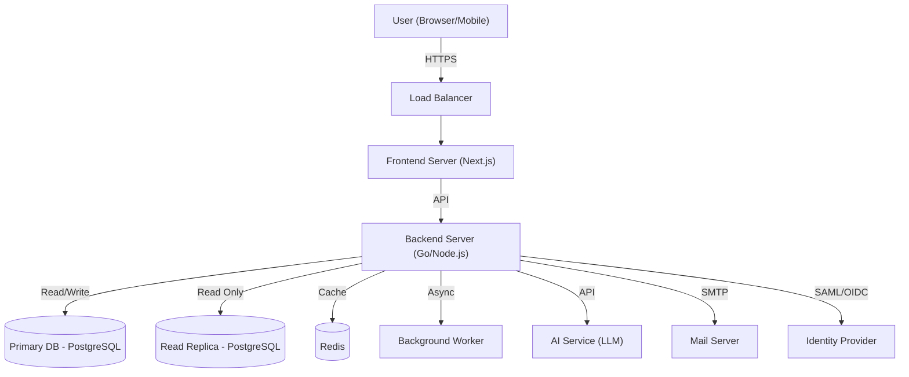
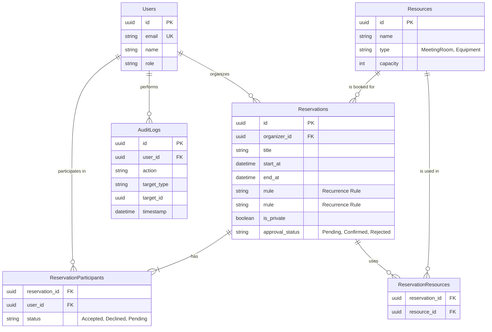
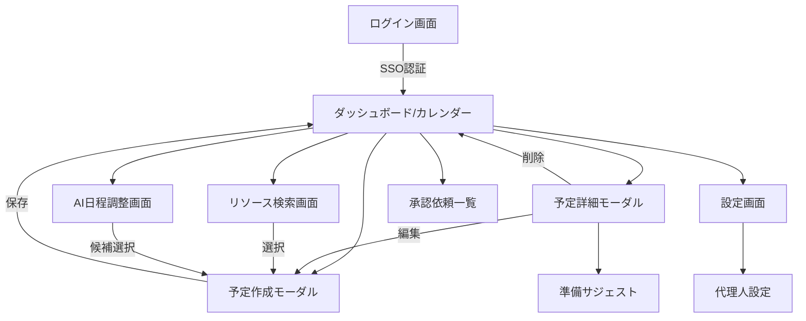

# 基本設計書 (Basic Design Document)

| 項目 | 内容 |
| :--- | :--- |
| **プロジェクト名称** | 企業向け次世代統合スケジュール管理システム |
| **文書バージョン** | 1.0.0 |
| **作成日** | 2025年11月23日 |
| **対象システム** | Enterprise Schedule Management System (ESMS) |

## 1. はじめに

### 1.1 目的
本文書は、ソフトウェア要求仕様書 (SRS) に基づき、Enterprise Schedule Management System (ESMS) の基本設計（アーキテクチャ、機能、データ、インターフェース、セキュリティ）を定義するものである。

### 1.2 適用範囲
本設計は、ESMSのWebアプリケーション全体、および関連するバッチ処理、外部連携インターフェースを対象とする。

## 2. システムアーキテクチャ

### 2.1 論理アーキテクチャ構成
本システムは、クライアントサイドレンダリング (CSR) とサーバーサイドレンダリング (SSR) を組み合わせたWebアプリケーションとして構成する。

### 2.2 技術スタック
| レイヤー | 技術要素 | 選定理由 |
| :--- | :--- | :--- |
| **Frontend** | React, Next.js, TypeScript | 高速なレンダリング、SEO対策（社内検索）、型安全性による品質確保。 |
| **Backend** | Go (Golang) | 高い並行処理性能（goroutine）、静的型付け、コンパイル言語による堅牢性。 |
| **Database** | PostgreSQL | 複雑なリレーション（多対多）とトランザクション処理への信頼性。 |
| **Cache** | Redis | セッション管理、頻繁なデータアクセスの高速化。 |
| **AI** | External LLM API (e.g., Gemini, OpenAI) | 自然言語処理による日程調整機能の実現。 |

## 3. 機能設計

### 3.1 機能一覧
SRSの機能要件に基づき、以下の機能を実装する。

| 機能ID | 機能名称 | 概要 | 対応SRS |
| :--- | :--- | :--- | :--- |
| **FN-01** | 認証・認可 | SSO (SAML/OIDC) によるログイン、ロールベースアクセス制御 (RBAC)。 | REQ-04, REQ-SEC1 |
| **FN-02** | 予定管理 | 予定の作成、参照、更新、削除 (CRUD)。繰り返し予定対応。 | REQ-01, REQ-03 |
| **FN-03** | リソース予約 | 会議室、備品の検索と予約。重複チェック（排他制御）。 | REQ-01, REQ-02, REQ-07 |
| **FN-04** | AI日程調整 | 自然言語プロンプトによる空き時間検索と候補提案。 | REQ-06 |
| **FN-05** | 代理操作 | 秘書権限による他者カレンダーの操作。 | REQ-04 |
| **FN-06** | 外部連携 | 社外ゲストへの招待メール送信、参加可否の取り込み。 | REQ-08 |
| **FN-07** | チェックイン | 利用開始確認、未チェックイン時の自動キャンセル。 | REQ-09 |
| **FN-08** | 通知 | メールおよびチャットツールへの通知。 | 3.1.2 |
| **FN-09** | 会議準備支援 | 予定内容に基づく資料・議事録のレコメンド。 | REQ-10 |
| **FN-10** | 承認ワークフロー | 重要会議の上長承認プロセス。 | REQ-11 |
| **FN-11** | キャンセルポリシー | 直前キャンセルの警告とペナルティ記録。 | REQ-12 |

### 3.2 重要ロジック設計

#### 3.2.1 排他制御 (Conflict Resolution)
*   **戦略:** 楽観的ロックではなく、データベースの制約またはトランザクション内でのロック（`SELECT FOR UPDATE` 等）を用いた悲観的ロックに近いアプローチを採用し、物理的なダブルブッキングを確実に防ぐ。
*   **フロー:**
    1.  トランザクション開始
    2.  対象リソース・時間帯の既存予約をロック付きで検索
    3.  重複があればロールバック＆エラー返却
    4.  重複がなければ予約レコード挿入
    5.  コミット

#### 3.2.2 繰り返し予定の展開
*   **戦略:** 繰り返しルール（RRULE）を保持しつつ、検索性能向上のため、直近（例：3年分）の予定インスタンスを実データとして展開する、または検索時に動的に展開するハイブリッド方式を検討する。
*   **変更時:** 「以降すべて変更」の場合は、既存の将来インスタンスを削除し、新たなルールで再生成する。

## 4. データ設計

### 4.1 ER図 (Entity Relationship Diagram)

### 4.2 テーブル定義概要
*   **Users:** ユーザー情報。IdPからの同期データを保持。
*   **Resources:** 会議室や備品のマスターデータ。
*   **Reservations:** 予定の基本情報。繰り返しルールの親データも兼ねる。
*   **ReservationParticipants:** 予定への参加者と参加ステータス。
*   **ReservationResources:** 予定で使用するリソース（多対多）。
*   **AuditLogs:** 監査ログ。操作履歴を記録。

## 5. インターフェース設計

### 5.1 画面遷移図

### 5.2 API設計方針
*   **プロトコル:** RESTful API (JSON over HTTPS)
*   **認証:** Authorization Header に Bearer Token (JWT) を設定。
*   **バージョニング:** URLパスにバージョンを含める (例: `/api/v1/events`)。
*   **エラーハンドリング:** HTTPステータスコード (2xx, 4xx, 5xx) と、詳細エラーメッセージを含むJSONレスポンスを返す。

## 6. インフラ・セキュリティ設計

### 6.1 ネットワーク構成
*   VPC内にパブリックサブネット（LB）とプライベートサブネット（App, DB）を配置。
*   インターネットからの直接アクセスはLBのみ許可。
*   DBへのアクセスはAppサーバーからのみ許可。

### 6.2 セキュリティ対策
*   **通信暗号化:** 全経路でTLS 1.2以上を強制。(ただし開発環境においては暗号化を実施せずに開発できるように配慮する)
*   **入力値検証:** フロントエンドとバックエンドの双方でバリデーションを実施。
*   **SQLインジェクション対策:** ORMまたはプレースホルダを使用したクエリ実行。
*   **XSS対策:** フレームワーク（React/Next.js）の標準エスケープ機能を利用。
*   **CSRF対策:** トークンベースの対策またはSameSite Cookie属性の利用。
*   **監査ログ:** 重要な操作（予約作成・削除、権限変更等）をすべて記録し、改ざん不能なストレージへ転送またはバックアップする。
