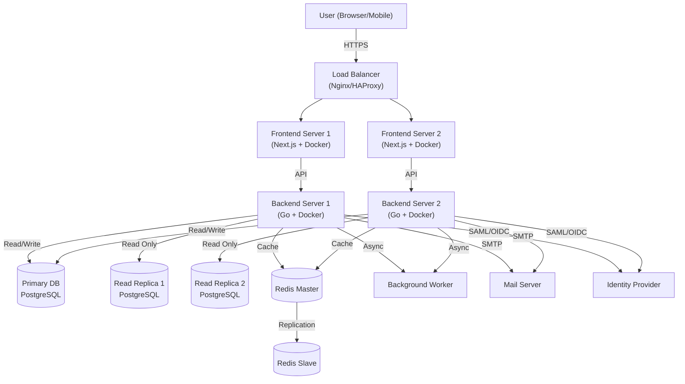
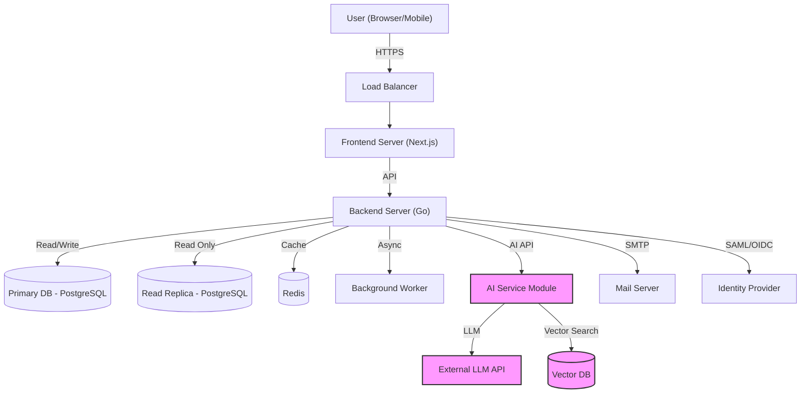
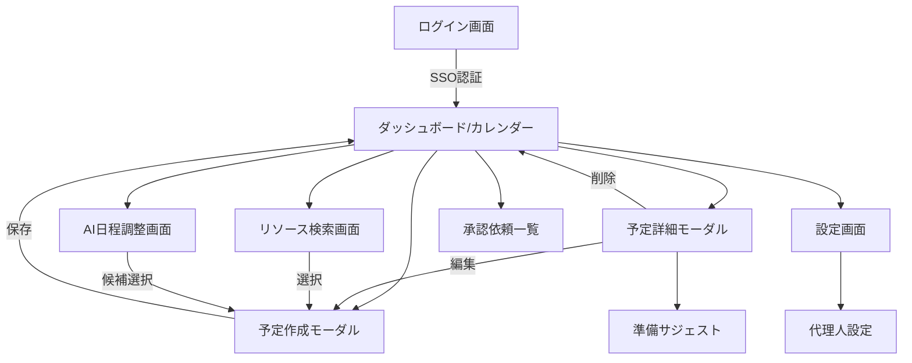

<!--
Depends On: docs/ieee830.md
Depended On By: docs/detailed/01_auth_security.md, docs/detailed/02_schedule_resource.md, docs/detailed/03_ai_assistant.md, docs/detailed/04_collaboration.md, docs/detailed/05_common_infra.md, docs/detailed/06_test_cases.md
-->
# 基本設計書 (Basic Design Document)

| 項目 | 内容 |
| :--- | :--- |
| **プロジェクト名称** | 企業向け次世代統合スケジュール管理システム |
| **文書バージョン** | 1.0.0 |
| **作成日** | 2025年11月23日 |
| **対象システム** | Enterprise Schedule Management System (ESMS) |

## 1. はじめに

### 1.1 目的
本文書は、ソフトウェア要求仕様書 (SRS) に基づき、Enterprise Schedule Management System (ESMS) の基本設計（アーキテクチャ、機能、データ、インターフェース、セキュリティ）を定義するものである。

### 1.2 適用範囲
本設計は、ESMSのWebアプリケーション全体、および関連するバッチ処理、外部連携インターフェースを対象とする。

## 2. システムアーキテクチャ

### 2.1 論理アーキテクチャ構成
本システムは、クライアントサイドレンダリング (CSR) とサーバーサイドレンダリング (SSR) を組み合わせたWebアプリケーションとして構成する。

#### Phase 1 アーキテクチャ構成（オンプレミス基本構成）


#### Phase 2 拡張アーキテクチャ構成


### 2.2 技術スタック

#### Phase 1 (初期リリース) 技術スタック
| レイヤー | 技術要素 | 選定理由 |
| :--- | :--- | :--- |
| **Frontend** | React, Next.js, TypeScript | 高速なレンダリング、SEO対策（社内検索）、型安全性による品質確保。 |
| **Backend** | Go (Golang) | 高い並行処理性能（goroutine）、静的型付け、コンパイル言語による堅牢性。 |
| **Database** | PostgreSQL | 複雑なリレーション（多対多）とトランザクション処理への信頼性。 |
| **Cache** | Redis (Master-Slave構成) | セッション管理、頻繁なデータアクセスの高速化。冗長化による可用性確保。 |
| **Load Balancer** | Nginx / HAProxy | 複数サーバーへの負荷分散、SSL終端処理。 |
| **Container** | Docker | 環境間の移植性確保、デプロイの標準化。 |
| **IaC** | Terraform | インフラ構成の自動化、環境間の一貫性確保。 |

#### Phase 2 (将来拡張) 追加技術スタック
| レイヤー | 技術要素 | 選定理由 |
| :--- | :--- | :--- |
| **AI Service** | External LLM API (OpenAI/Gemini) | 自然言語処理による日程調整機能の実現。 |
| **Vector DB** | pgvector (オンプレ) / Pinecone (クラウド) | 会議準備サジェスト用の文書検索。環境に応じて選択。 |

#### クラウド移行オプション
オンプレミス構成からクラウドへの移行時は、以下のマネージドサービスを活用可能：
- **Database**: RDS (AWS) / Azure Database / Cloud SQL (GCP)
- **Cache**: ElastiCache (AWS) / Redis Cache (Azure) / Memorystore (GCP)
- **Container**: ECS (AWS) / Container Instances (Azure) / Cloud Run (GCP)

### 2.3 サーバー構成・スペック要件

#### 推奨サーバー構成（2,000人同時接続対応）
| サーバー種別 | 台数 | CPU | メモリ | ストレージ | 役割 |
| :--- | :--- | :--- | :--- | :--- | :--- |
| **Load Balancer** | 2台 | 4コア | 8GB | 100GB SSD | 負荷分散、SSL終端 |
| **Web/App Server** | 4台 | 8コア | 16GB | 200GB SSD | アプリケーション実行 |
| **DB Primary** | 1台 | 16コア | 64GB | 1TB SSD | 読み書き処理 |
| **DB Read Replica** | 2台 | 12コア | 32GB | 1TB SSD | 読み取り専用 |
| **Redis Master** | 1台 | 8コア | 32GB | 500GB SSD | キャッシュ・セッション |
| **Redis Slave** | 1台 | 8コア | 32GB | 500GB SSD | 冗長化 |

#### ネットワーク要件
- **帯域幅**: 1Gbps以上（冗長化推奨）
- **レイテンシ**: サーバー間 < 1ms
- **セキュリティ**: VLAN分離、ファイアウォール設定

### 2.4 非機能指標 (SLA/SLO/負荷前提)
#### Phase 1 負荷前提・SLO
*   **想定負荷:** アクティブユーザー 10,000人、ピーク同時接続 2,000、1日あたり予約作成 80,000件、通知配信 150,000件。
*   **目標SLO:**
    - 予約作成・更新 API p95 レイテンシ 400ms 以下、成功率 99.5% 以上。
    - ダッシュボード初期表示 p95 1.5s 以下。
    - 高度検索機能 p95 2s 以下。

#### Phase 2 追加負荷前提・SLO
*   **追加想定負荷:** LLM呼び出し 20,000回/日、ベクトル検索 50,000回/日。
*   **追加SLO:**
    - AI日程調整応答 p95 6s 以下（LLM応答を含む）。
    - 会議準備サジェスト p95 3s 以下。
*   **可用性/SLA:** 月間 99.9% 稼働。主要メンテナンスは事前告知の上、SLA 除外。
*   **バックアップ/RPO/RTO:** DB Point-in-Time Recovery、RPO 5分、RTO 30分。オブジェクトストレージへの監査ログ定期転送。
*   **スケール戦略:** 予約作成後 60秒間は読み取りをプライマリにスティッキーさせ、レプリカ遅延は 500ms 以内を監視。
*   **キャッシュ戦略:** リソース空き状況は競合回避のためキャッシュなし。個人カレンダー等は短期キャッシュ（TTL 5分）で性能向上。予約操作時は操作者本人のキャッシュを即座無効化、他の参加者は非同期無効化。

### 2.4 バックグラウンドジョブ/可観測性
#### Phase 1 バックグラウンドジョブ・可観測性
*   **ジョブ種別:** 通知送信（メール/チャット、リトライ3回・指数バックオフ）、未チェックイン予約の自動解放、エクスポート/バックアップ転送。冪等性キーは予約ID＋ジョブ種別で管理し、3回失敗でデッドレターへ送る。
*   **可観測性:** OpenTelemetry によるトレース/メトリクス/ログ収集。主要メトリクスは予約作成成功率、API p95/p99、ジョブ失敗率、レプリカレイテンシ。ダッシュボードでSLO違反をアラート。

#### Phase 2 追加ジョブ・可観測性
*   **追加ジョブ種別:** AIバッチ（要約/レコメンドの事前生成）、ベクトルDB同期、学習データ収集。
*   **追加メトリクス:** LLM呼び出し成功率・平均コスト、ベクトル検索レイテンシ、AI機能利用率。
*   **AIフォールバック:** LLM呼び出しはタイムアウト 4s、1分間 200 回のレートリミット。失敗時は「AI候補なし」で従来検索のみを返却し、プロンプト入力を安全に破棄。過去成功結果の15分キャッシュを再利用。

## 3. 機能設計

### 3.1 機能一覧

#### Phase 1 実装機能
SRSの機能要件に基づき、以下の機能を Phase 1 で実装する。

| 機能ID | 機能名称 | 概要 | 対応SRS |
| :--- | :--- | :--- | :--- |
| **FN-01** | 認証・認可 | SSO (SAML/OIDC) によるログイン、ロールベースアクセス制御 (RBAC)。 | REQ-04, REQ-SEC1 |
| **FN-02** | 予定管理 | 予定の作成、参照、更新、削除 (CRUD)。繰り返し予定対応。 | REQ-01, REQ-03 |
| **FN-03** | リソース予約 | 会議室、備品の検索と予約。重複チェック（排他制御）。 | REQ-01, REQ-02, REQ-07 |
| **FN-05** | 代理操作 | 秘書等による代理予約・編集。 | REQ-04 |
| **FN-06** | 外部連携 | 社外ゲストへの招待状送付、参加可否連携。 | REQ-08 |
| **FN-07** | チェックイン | 会議室の利用開始確認・自動キャンセル。 | REQ-09 |
| **FN-08** | 通知 | 予約作成・変更・リマインドの通知（メール/チャット）。 | - |
| **FN-09** | リソース権限制御 | 特定リソースの役職ベースアクセス制御。 | REQ-13 |
| **FN-10** | キャンセルポリシー | 直前キャンセルの警告とペナルティ記録。 | REQ-14 |
| **FN-11** | 高度検索 | 複数条件での空き時間検索・フィルタリング機能（参加者・期間・リソース条件の組み合わせ）。 | REQ-06, REQ-07 |

#### Phase 2 拡張機能（将来実装）
| 機能ID | 機能名称 | 概要 | 対応SRS |
| :--- | :--- | :--- | :--- |
| **FN-12** | AI日程調整 | 自然言語による複数人の日程調整。 | REQ-08 |
| **FN-13** | 会議準備支援 | AI による議事録・テンプレートのレコメンド。 | REQ-09 |

### 3.2 重要ロジック設計

#### 3.2.1 排他制御 (Conflict Resolution)

##### 基本戦略
**ダブルブッキング絶対回避**を最優先とし、悲観的ロックによる厳密な排他制御を実装する。

##### ロック粒度設計
- **ロック単位**: リソースID × 時間範囲の組み合わせ
- **ロック対象**: `ReservationResources` テーブルの該当レコード
- **ロック順序**: リソースIDの昇順でロック取得（デッドロック回避）

##### 詳細実装フロー
```sql
-- 1. トランザクション開始（分離レベル: SERIALIZABLE）
BEGIN TRANSACTION ISOLATION LEVEL SERIALIZABLE;

-- 2. 対象リソースを昇順でロック取得
SELECT resource_id FROM unnest($resource_ids) AS r(resource_id) 
ORDER BY resource_id FOR UPDATE;

-- 3. 時間重複チェック（既存予約との競合確認）
SELECT rr.resource_id, ri.start_at, ri.end_at 
FROM reservation_resources rr
JOIN reservation_instances ri ON rr.reservation_instance_id = ri.id
WHERE rr.resource_id = ANY($resource_ids)
  AND ri.start_at < $new_end_at 
  AND ri.end_at > $new_start_at
  AND ri.status = 'CONFIRMED'
FOR UPDATE;

-- 4. 競合判定
IF found_conflicts THEN
    ROLLBACK;
    RETURN conflict_error_with_alternatives;
END IF;

-- 5. 予約レコード挿入
INSERT INTO reservations (...) VALUES (...);
INSERT INTO reservation_instances (...) VALUES (...);
INSERT INTO reservation_resources (...) VALUES (...);

-- 6. コミット
COMMIT;
```

##### エラーハンドリング・リトライ戦略
- **タイムアウト**: ロック取得タイムアウト 5秒
- **リトライ**: 最大3回、指数バックオフ（100ms, 200ms, 400ms）
- **デッドロック検知**: PostgreSQLの自動デッドロック検知に依存
- **競合時対応**: 代替リソース・時間帯の自動提案

##### パフォーマンス最適化
- **ロック保持時間**: 最大500ms以内でトランザクション完了
- **接続プール**: デッドロック発生時の即座な接続解放

#### 3.2.2 繰り返し予定の物理展開戦略

##### 基本方針
個別編集可能性を重視し、繰り返し予定も物理的にインスタンス展開する方式を採用。

##### 展開ロジック
繰り返し予定作成時に、RRULE（iCalendar形式）を解析し、指定された期間（デフォルト2年）分のインスタンスを `reservation_instances` テーブルに物理的に展開する。

**処理概要:**
1. RRULE文字列の解析（頻度、終了条件、例外日等）
2. 展開期間内の各発生日時を計算
3. 各インスタンスを個別レコードとして挿入
4. 展開されたインスタンス数を返却

##### 個別編集対応
- **例外インスタンス**: `original_start_at` と `start_at` が異なる場合は個別編集済み
- **削除処理**: 論理削除（`deleted_at`）で対応
- **一括変更**: 「以降すべて変更」時は未来インスタンスを再生成

##### 自動展開バッチ
毎日夜間に実行されるバッチ処理により、展開期間を常に2年先まで維持する。

**処理概要:**
1. 展開が不足している繰り返し予定を特定
2. 18ヶ月先以降のインスタンスが存在しない予定を抽出
3. 不足分のインスタンスを自動生成・挿入
4. 処理結果をログに記録

### 3.3 ワークフロー詳細
*   **リソース権限制御:** 特定リソース（役員会議室、高額備品等）は役職レベルでアクセス制御。予約時に権限チェックを実施し、権限不足時はエラーを返却。
*   **キャンセルポリシー:** 予定開始24時間前以降のキャンセルでペナルティスコア＋1（90日ローテーション）。スコア3以上でハイリスク通知を管理者へ送付、5以上で当人の新規予約を制限。
*   **通知戦略:** テンプレートをチャネル別に管理（メール、社内チャット）。通知はジョブキュー経由で最大3回リトライし、7日間はサプレッションキー（予約ID＋テンプレート）で重複送信を防止。

#### Phase 2 追加セキュリティ要件
*   **AI日程調整セキュリティ:** プロンプト送信前に参加者メール・電話番号をマスキング。組織外ユーザーは候補スロットのみ提示し、詳細情報は返さない。利用ログには要求IDとトークナイズドのプロンプト長のみを記録し、本文は保存しない。

## 4. データ設計

### 4.1 パーティショニング戦略

#### 4.1.1 年別パーティション設計
大量データ（月200,000件想定）の効率的な管理のため、年別パーティショニングを実装。

```sql
-- 親テーブル（パーティション化）
CREATE TABLE reservations (
    id UUID PRIMARY KEY,
    organizer_id UUID NOT NULL,
    title VARCHAR(255) NOT NULL,
    start_at TIMESTAMPTZ NOT NULL,
    end_at TIMESTAMPTZ NOT NULL,
    created_at TIMESTAMPTZ DEFAULT NOW()
) PARTITION BY RANGE (start_at);

-- 年別パーティション（自動作成）
CREATE TABLE reservations_2025 PARTITION OF reservations
FOR VALUES FROM ('2025-01-01') TO ('2026-01-01');

CREATE TABLE reservations_2026 PARTITION OF reservations
FOR VALUES FROM ('2026-01-01') TO ('2027-01-01');
```

#### 4.1.2 自動パーティション管理
現在年から2年先までのパーティションを自動的に作成・維持する仕組みを実装。

**処理概要:**
1. 現在年を基準に、必要なパーティション年を計算
2. 各年について、パーティションテーブルの存在確認
3. 存在しない場合のみ、年別パーティションを作成
4. 毎月1日にcronジョブとして実行

#### 4.1.3 DBA調整可能な設計
運用開始後にDBAがパーティション戦略を変更できるよう、設定管理テーブルと移行支援機能を提供。

**設定管理:**
- パーティション戦略（yearly/monthly/quarterly）
- データ保持期間の設定
- 自動作成の有効/無効制御

**移行支援:**
- 既存データの新パーティション戦略への移行
- 移行スクリプトの自動生成
- 段階的移行による無停止対応

### 4.2 インデックス戦略

#### 4.2.1 段階的インデックス設計
使用頻度に基づく優先度付きインデックス戦略を採用。

##### Phase 1: カレンダー表示最適化（最優先）
```sql
-- 個人カレンダー表示（最頻繁アクセス）
CREATE INDEX CONCURRENTLY idx_reservations_user_calendar
ON reservations (organizer_id, start_at DESC)
INCLUDE (title, end_at, is_private);

-- 参加者別予定一覧
CREATE INDEX CONCURRENTLY idx_participants_calendar  
ON reservation_participants (user_id, status)
INCLUDE (reservation_id);

-- 時間範囲検索（月表示等）
CREATE INDEX CONCURRENTLY idx_reservations_time_range
ON reservations USING GIST (tstzrange(start_at, end_at));
```

##### Phase 2: 運用後追加予定（性能監視後）
```sql
-- 空き時間検索用（複数人日程調整）
-- ※実際の使用パターン確認後に追加
CREATE INDEX CONCURRENTLY idx_multi_user_availability
ON reservation_participants (user_id, reservation_id)
WHERE status IN ('ACCEPTED', 'NEEDS_ACTION');

-- リソース空き状況検索用
-- ※会議室予約頻度確認後に追加  
CREATE INDEX CONCURRENTLY idx_resource_availability
ON reservation_resources (resource_id)
INCLUDE (reservation_id);
```

#### 4.2.2 性能監視・チューニング運用

##### 監視対象メトリクス
```sql
-- 遅いクエリの特定
SELECT query, mean_exec_time, calls, total_exec_time
FROM pg_stat_statements 
WHERE mean_exec_time > 100 -- 100ms超のクエリ
ORDER BY mean_exec_time DESC;

-- インデックス使用状況
SELECT schemaname, tablename, indexname, 
       idx_tup_read, idx_tup_fetch, idx_scan
FROM pg_stat_user_indexes
WHERE idx_scan < 100; -- 使用頻度の低いインデックス
```

##### チューニング手順
1. **週次レポート**: 遅いクエリと未使用インデックスを特定
2. **月次レビュー**: 実際の使用パターンに基づくインデックス追加・削除
3. **四半期最適化**: パーティション戦略の見直し

**インデックス追加支援:**
- 性能監視結果に基づく自動インデックス提案
- 無停止でのインデックス追加（CONCURRENTLY）
- インデックス名の自動生成とネーミング規則統一

### 4.3 ER図 (Entity Relationship Diagram)

```mermaid
erDiagram
    Users ||--o{ Reservations : "organizes"
    Users ||--o{ ReservationParticipants : "participates in"
    Users ||--o{ AuditLogs : "performs"

    Resources ||--o{ Reservations : "is booked for"

    Reservations ||--|{ ReservationParticipants : "has"
    Reservations ||--o{ ReservationResources : "uses"

    Resources ||--o{ ReservationResources : "is used in"

    Users {
        uuid id PK
        string email UK
        string name
        string role
    }

    Resources {
        uuid id PK
        string name
        string type "MeetingRoom, Equipment"
        int capacity
    }

    Reservations {
        uuid id PK
        uuid organizer_id FK
        string title
        datetime start_at
        datetime end_at
        string rrule "Recurrence Rule"
        boolean is_private
        string approval_status "Pending, Confirmed, Rejected"
        string timezone
        uuid updated_by FK
        int version
        datetime deleted_at
    }

    ReservationParticipants {
        uuid reservation_id FK
        uuid user_id FK
        string status "Accepted, Declined, Pending"
    }
    
    ReservationResources {
        uuid reservation_id FK
        uuid resource_id FK
        UNIQUE(reservation_id, resource_id)
    }

    AuditLogs {
        uuid id PK
        uuid user_id FK
        string action
        string target_type
        uuid target_id
        datetime timestamp
        string signature_hash
    }
```

### 4.2 テーブル定義概要
*   **Users:** ユーザー情報。IdPからの同期データを保持。
*   **Resources:** 会議室や備品のマスターデータ。
*   **Reservations:** 予定の基本情報。繰り返しルールの親データも兼ねる。タイムゾーン、更新者、バージョン（楽観ロック用）、論理削除を保持。
*   **ReservationParticipants:** 予定への参加者と参加ステータス。承認者は `role=approver` として別枠管理。
*   **ReservationResources:** 予定で使用するリソース（多対多）。(reservation_id, resource_id) でユニーク。
*   **AuditLogs:** 監査ログ。操作履歴を記録し、`signature_hash` で改ざん検知。WORM/SIEMへ転送。

### 4.3 インデックス・パーティション・アクセス制御
*   **インデックス:** `Reservations(start_at, end_at)`, `ReservationParticipants(user_id, status)`, `ReservationResources(resource_id)`, `Reservations(approval_status)` に複合/部分インデックスを付与。キャンセルペナルティ集計用に `AuditLogs(action, timestamp)` も索引化。
*   **パーティション:** `Reservations` は日付（月単位）パーティションを検討し、古いデータはアーカイブテーブルへ移送。
*   **アクセス制御:** `is_private` 予定は参加者・代理人のみ閲覧可。代理操作権限はプロキシテーブル（User-to-User、開始・終了日時、権限スコープ）で管理し、ビュー/APIでフィルタリングする。

## 5. インターフェース設計

### 5.1 画面遷移図



### 5.2 API設計方針
*   **プロトコル:** RESTful API (JSON over HTTPS)
*   **認証:** Authorization Header に Bearer Token (JWT) を設定。
*   **バージョニング:** URLパスにバージョンを含める (例: `/api/v1/events`)。
*   **統一レスポンス:** 成功・エラー問わず統一されたJSONエンベロープ形式を採用。
*   **エラーハンドリング:** HTTPステータスコード + 詳細なエラー情報（コード・メッセージ・フィールド別詳細）を提供。
*   **国際化対応:** エラーメッセージの多言語化とクライアント側での表示制御をサポート。

### 5.3 統一レスポンス形式

#### 5.3.1 レスポンスエンベロープ
全てのAPIエンドポイントは以下の統一形式でレスポンスを返却する。

**成功レスポンス (HTTP 2xx):**
```json
{
  "success": true,
  "data": {
    // 実際のレスポンスデータ
  },
  "meta": {
    "requestId": "req_1234567890abcdef",
    "timestamp": "2025-11-23T10:00:00Z",
    "version": "v1",
    "pagination": {  // ページネーション対象の場合のみ
      "limit": 20,
      "cursor": "next_cursor_token",
      "hasMore": true
    }
  }
}
```

**エラーレスポンス (HTTP 4xx/5xx):**
```json
{
  "success": false,
  "error": {
    "code": "VALIDATION_ERROR",
    "message": "Request validation failed",
    "details": [
      {
        "field": "startAt",
        "code": "INVALID_FORMAT", 
        "message": "must be ISO8601 format",
        "value": "2025-13-01"
      }
    ]
  },
  "meta": {
    "requestId": "req_1234567890abcdef",
    "timestamp": "2025-11-23T10:00:00Z",
    "version": "v1"
  }
}
```

#### 5.3.2 エラーコード体系
階層的なエラーコード設計により、クライアント側での適切なエラーハンドリングを支援。

| レベル | エラーコード | 説明 | HTTPステータス |
| :--- | :--- | :--- | :--- |
| **認証・認可** | `UNAUTHORIZED` | 認証情報なし・無効 | 401 |
| | `FORBIDDEN` | 権限不足 | 403 |
| | `TOKEN_EXPIRED` | トークン期限切れ | 401 |
| **バリデーション** | `VALIDATION_ERROR` | 入力値検証エラー | 400 |
| | `INVALID_FORMAT` | フォーマット不正 | 400 |
| | `REQUIRED_FIELD` | 必須フィールド未入力 | 400 |
| | `OUT_OF_RANGE` | 値が範囲外 | 400 |
| **ビジネスロジック** | `CONFLICT` | リソース競合 | 409 |
| | `RESOURCE_NOT_FOUND` | リソース未存在 | 404 |
| | `BUSINESS_RULE_VIOLATION` | ビジネスルール違反 | 422 |
| **システム** | `INTERNAL_ERROR` | サーバー内部エラー | 500 |
| | `SERVICE_UNAVAILABLE` | サービス利用不可 | 503 |
| | `RATE_LIMITED` | レート制限超過 | 429 |

### 5.4 API/DTO インターフェース仕様
#### 5.4.1 エンドポイント一覧
| グループ | メソッド | パス | 主な機能 | 備考 |
| :--- | :--- | :--- | :--- | :--- |
| 認証 | POST | `/api/v1/auth/login` | SSO/OIDC 後のトークン交換 | IdP コールバックで利用 |
| 認証 | POST | `/api/v1/auth/refresh` | リフレッシュトークンでアクセストークン再発行 | トークンローテーション対応 |
| ユーザー | GET | `/api/v1/users/me` | ログインユーザー情報取得 | 権限ロールを含む |
| 予定 | GET | `/api/v1/events` | 自身が閲覧可能な予定一覧取得 | クエリで期間・リソース指定 |
| 予定 | POST | `/api/v1/events` | 予定作成 | 重複チェック付き |
| 予定 | GET | `/api/v1/events/{eventId}` | 予定詳細取得 | 参加者・リソースを含む |
| 予定 | PATCH | `/api/v1/events/{eventId}` | 予定更新 | RRULE変更時は再展開 |
| 予定 | DELETE | `/api/v1/events/{eventId}` | 予定キャンセル | キャンセルポリシー判定 |
| リソース | GET | `/api/v1/resources` | 会議室/備品検索 | 収容人数・設備でフィルタ |
| 承認 | POST | `/api/v1/events/{eventId}/approvals` | 承認/却下アクション | コメント必須 |
| 通知 | POST | `/api/v1/events/{eventId}/notifications` | 通知再送要求 | 冪等キー必須 |

* **共通仕様**
    - リクエストヘッダー: `Authorization: Bearer <JWT>`, `X-Request-Id`（トレース用）、`Content-Type: application/json`。
    - ページネーション: `limit`（1〜200、デフォルト50）、`cursor` をクエリに指定。レスポンスは `nextCursor` を返却。
    - 並び順: `sort` クエリ（`startAt asc|desc`）。
    - 部分項目取得: `fields` クエリで返却カラムを制限（例: `fields=title,startAt,endAt`）。

#### 5.4.2 リクエスト/レスポンス例（抜粋）
* **POST `/api/v1/events` (予定作成)**
    - リクエスト
    ```json
    {
      "title": "プロジェクト定例",
      "startAt": "2025-12-01T10:00:00Z",
      "endAt": "2025-12-01T11:00:00Z",
      "timezone": "Asia/Tokyo",
      "resources": [
        { "resourceId": "room-101", "required": true }
      ],
      "participants": [
        { "userId": "u-123", "role": "organizer" },
        { "userId": "u-456", "role": "attendee" }
      ],
      "recurrence": {
        "rrule": "FREQ=WEEKLY;COUNT=4",
        "until": null
      },
      "allowProxy": true,
      "notes": "アジェンダ共有予定"
    }
    ```
    - 成功レスポンス
    ```json
    {
      "success": true,
      "data": {
        "eventId": "evt-9001",
        "conflict": false,
        "approvalStatus": "Confirmed",
        "createdAt": "2025-11-24T02:30:00Z"
      },
      "meta": {
        "requestId": "req_1234567890abcdef",
        "timestamp": "2025-11-24T02:30:00Z",
        "version": "v1"
      }
    }
    ```
    - 競合エラーレスポンス
    ```json
    {
      "success": false,
      "error": {
        "code": "CONFLICT",
        "message": "Resource conflict detected",
        "details": [
          {
            "field": "resources[0].resourceId",
            "code": "RESOURCE_UNAVAILABLE",
            "message": "Room is already booked for this time slot",
            "value": "room-101",
            "conflictDetails": {
              "resourceId": "room-101",
              "conflictingEventId": "evt-8999",
              "conflictStart": "2025-12-01T09:30:00Z",
              "conflictEnd": "2025-12-01T11:30:00Z",
              "alternatives": [
                {
                  "resourceId": "room-102",
                  "name": "B会議室",
                  "startAt": "2025-12-01T10:00:00Z",
                  "endAt": "2025-12-01T11:00:00Z"
                }
              ]
            }
          }
        ]
      },
      "meta": {
        "requestId": "req_1234567890abcdef",
        "timestamp": "2025-11-24T02:30:00Z",
        "version": "v1"
      }
    }
    ```

* **GET `/api/v1/events` (予定一覧) 例**
    ```json
    {
      "success": true,
      "data": {
        "items": [
          {
            "eventId": "evt-9001",
            "title": "プロジェクト定例",
            "startAt": "2025-12-01T10:00:00Z",
            "endAt": "2025-12-01T11:00:00Z",
            "isPrivate": false,
            "resources": [
              { "resourceId": "room-101", "name": "A会議室" }
            ]
          }
        ]
      },
      "meta": {
        "requestId": "req_1234567890abcdef",
        "timestamp": "2025-11-24T02:30:00Z",
        "version": "v1",
        "pagination": {
          "limit": 20,
          "cursor": null,
          "hasMore": false
        }
      }
    }
    ```

* **GET `/api/v1/events/{eventId}` (予定詳細) 例**
    ```json
    {
      "success": true,
      "data": {
        "eventId": "evt-9001",
        "title": "プロジェクト定例",
        "startAt": "2025-12-01T10:00:00Z",
        "endAt": "2025-12-01T11:00:00Z",
        "timezone": "Asia/Tokyo",
        "isPrivate": false,
        "approvalStatus": "Confirmed",
        "resources": [
          { "resourceId": "room-101", "name": "A会議室", "required": true }
        ],
        "participants": [
          { "userId": "u-123", "role": "organizer", "status": "Accepted" },
          { "userId": "u-456", "role": "attendee", "status": "NeedsAction" }
        ],
        "recurrence": {
          "rrule": "FREQ=WEEKLY;COUNT=4",
          "until": null
        },
        "allowProxy": true,
        "notes": "アジェンダ共有予定",
        "updatedAt": "2025-11-24T02:30:00Z"
      },
      "meta": {
        "requestId": "req_1234567890abcdef",
        "timestamp": "2025-11-24T02:30:00Z",
        "version": "v1"
      }
    }
    ```

#### 5.4.3 バリデーション詳細

**主なバリデーションルール:**
- `startAt < endAt`、1件あたり最大12時間、過去時刻の新規作成禁止
- `title` は必須・最大200文字、制御文字禁止
- `participants` 最低1名、`organizer` が必須、代理作成時は委任期間内チェック
- `resources` は施設営業時間内、同一時間帯の重複予約は競合エラー
- `recurrence.rrule` は RFC 5545 準拠、`COUNT`/`UNTIL` いずれか必須、展開上限200インスタンス
- `timezone` は IANA 名称のみ許容

**フィールド別エラーコード:**
| フィールド | エラーコード | 説明 |
| :--- | :--- | :--- |
| `startAt` | `REQUIRED_FIELD` | 必須フィールド未入力 |
| | `INVALID_FORMAT` | ISO8601形式でない |
| | `OUT_OF_RANGE` | 過去時刻または営業時間外 |
| `title` | `REQUIRED_FIELD` | タイトル未入力 |
| | `TOO_LONG` | 200文字超過 |
| | `INVALID_CHARACTERS` | 制御文字含有 |
| `resources` | `RESOURCE_UNAVAILABLE` | リソース競合 |
| | `PERMISSION_DENIED` | リソースアクセス権限なし |
| `participants` | `INVALID_USER` | 存在しないユーザーID |
| | `ORGANIZER_REQUIRED` | 主催者が未指定 |

**バリデーションエラー例:**
```json
{
  "success": false,
  "error": {
    "code": "VALIDATION_ERROR",
    "message": "Request validation failed",
    "details": [
      {
        "field": "startAt",
        "code": "INVALID_FORMAT",
        "message": "must be ISO8601 format",
        "value": "2025-13-01"
      },
      {
        "field": "title",
        "code": "TOO_LONG",
        "message": "must be 200 characters or less",
        "value": "very long title..."
      }
    ]
  },
  "meta": {
    "requestId": "req_1234567890abcdef",
    "timestamp": "2025-11-24T02:30:00Z",
    "version": "v1"
  }
}
```

#### 5.4.4 OpenAPI仕様・型共有方針

**OpenAPI 3.1 仕様:**
- 全エンドポイントの詳細スキーマ定義（リクエスト・レスポンス・エラー）
- 統一レスポンスエンベロープの共通コンポーネント化
- バリデーションルールの詳細記述（pattern、format、範囲等）
- エラーコード・メッセージの多言語対応スキーマ

**コード生成・型共有:**
- バックエンド：OpenAPIからGo構造体・バリデーター自動生成
- フロントエンド：TypeScript型・Zodスキーマ自動生成
- 共通：エラーコード定数・メッセージテンプレート生成

**CI/CD統合:**
- OpenAPI定義の破壊的変更検知
- スキーマ差分レポート自動生成
- クライアント・サーバー同期ビルド
- API仕様書の自動更新・公開

**品質保証:**
- リクエスト・レスポンスの契約テスト
- エラーケースの網羅的テスト
- 多言語メッセージの整合性チェック

## 6. インフラ・セキュリティ設計

### 6.1 ネットワーク構成
*   VPC内にパブリックサブネット（LB）とプライベートサブネット（App, DB）を配置。
*   インターネットからの直接アクセスはLBのみ許可。
*   DBへのアクセスはAppサーバーからのみ許可。

### 6.2 セキュリティ対策
*   **通信暗号化:** 全経路でTLS 1.2以上を強制。開発環境も内部CAの自己署名証明書で常時TLSを維持し、例外を最小化する。
*   **入力値検証:** フロントエンドとバックエンドの双方でバリデーションを実施。
*   **SQLインジェクション対策:** ORMまたはプレースホルダを使用したクエリ実行。
*   **XSS対策:** フレームワーク（React/Next.js）の標準エスケープ機能を利用。
*   **CSRF対策:** SPAはトークン方式（Double Submit + Originチェック）、SSRはSameSite=Lax CookieとCSRFトークンを併用。
*   **RBACマトリクス:** 主要ロール（一般ユーザー、代理人、管理者、監査者）。管理者のみがリソースマスタ編集/ペナルティ解除、監査者のみが監査ログ照会。代理人は委任範囲内（期間・組織）で予約CRUD可。
*   **監査ログ:** 重要な操作（予約作成・削除、権限変更等）をすべて記録し、署名付きでWORMストレージ/外部SIEMへ転送。保存期間 3 年。

## 7. 非機能要求トレース
| 非機能カテゴリ | SRS参照 (ieee830) | 本基本設計での対応箇所 |
| :--- | :--- | :--- |
| 可用性 | NFR-01 | 2.3 非機能指標 (SLA/SLO)、バックアップ/RPO/RTO |
| 性能/スケーラビリティ | NFR-02, NFR-03 | 2.3 負荷前提とSLO、2.4 バックグラウンドジョブ、4.3 インデックス/パーティション |
| セキュリティ/監査 | REQ-SEC1, NFR-04 | 6.2 セキュリティ対策、4.2/4.3 監査ログ設計、(Future) 3.3 AIセキュリティ |
| 運用・監視 | NFR-05 | 2.4 可観測性、SLOアラート |
| プライバシー | NFR-06 | 4.3 アクセス制御、(Future) 3.3 AI日程調整セキュリティ |
