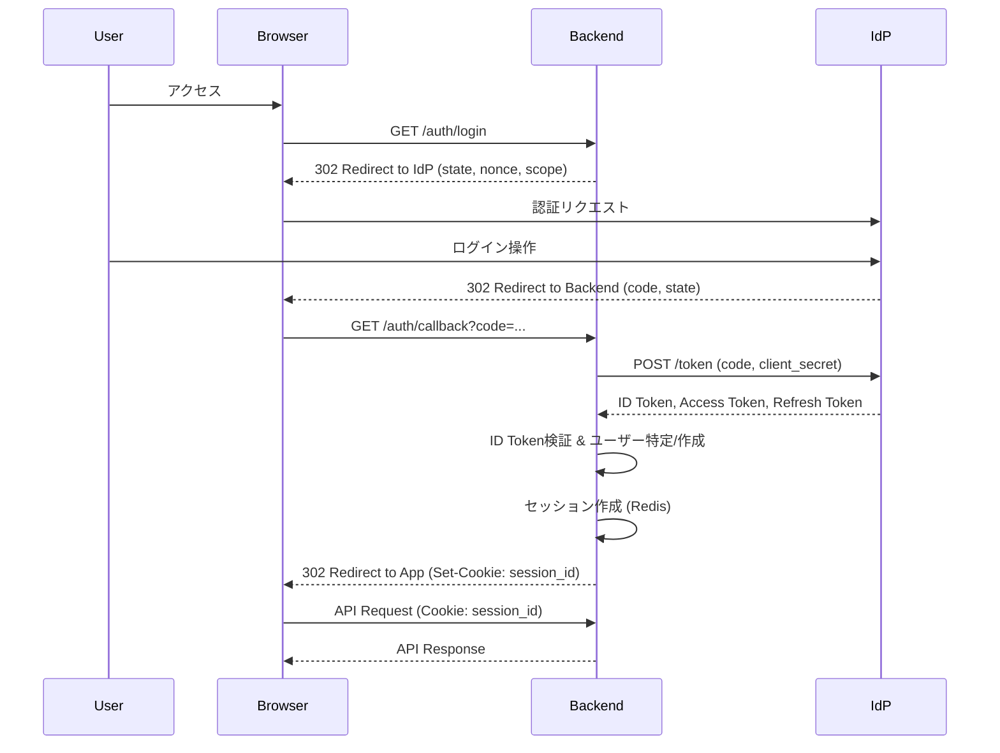

<!--
Depends On: docs/basic_design.md
Depended On By: None
-->
# 認証・セキュリティ詳細設計書

**対象機能:** FN-01 (認証・認可)

## 1. はじめに
本ドキュメントは、ESMSにおける認証および認可機能の詳細設計を記述する。
本システムは、社内統合ID基盤 (IdP) との連携を前提とし、OIDC (OpenID Connect) プロトコルを採用する。
MFA（多要素認証）はIdP側で強制されることを前提とし、本システム側ではMFAの有無を直接制御しない。

## 2. ID連携 (SAML/OIDC) フロー

### 2.1 OIDC 認証シーケンス (Authorization Code Flow)
フロントエンド (SPA) とバックエンド (API) が分離しているため、セキュリティを考慮し、BFF (Backend for Frontend) パターンまたはバックエンド主導の認可コードフローを採用する。ここではバックエンドでトークンをハンドリングする構成とする。

### 2.2 属性マッピング (Claims Mapping)
IdPから取得したID Tokenのクレームを、本システムのUserテーブルへ以下の通りマッピングする。

| IdP Claim | User Table Column | 説明 | 備考 |
| :--- | :--- | :--- | :--- |
| `sub` | `sub` (UK) | ユーザー識別子 | IdP側で不変のIDを使用 |
| `email` | `email` | メールアドレス | |
| `name` | `name` | 表示名 | |
| `groups` | `role` | ロール | グループ名からロールへの変換ロジックを実装 |

## 3. JWTトークン設計

本システム内部（フロントエンド-バックエンド間）のセッション管理には、HttpOnly Cookieを用いたセッションID方式、またはCookieにJWTを格納する方式を採用する。ここでは、ステートレス性とスケーラビリティを考慮し、**CookieにJWT (Access Token) を格納する方式** を基本とするが、セキュリティ要件によりOpaqueなセッションID + Redis (サーバーサイドセッション) とすることも可能である。
*本設計では、セキュリティと取り回しのバランスから「サーバーサイドセッション (Redis)」を採用する。*

### 3.1 セッション管理 (Redis)
JWTをクライアントに渡さず、バックエンドで管理することで、即時無効化 (Logout/Ban) を可能にする。

*   **Session ID:** ランダムな文字列 (32byte以上)
*   **Cookie:** `HttpOnly`, `Secure`, `SameSite=Lax`

### 3.2 Redis Key Design
| Key Pattern | Type | Value | TTL | 説明 |
| :--- | :--- | :--- | :--- | :--- |
| `session:{session_id}` | Hash | `{user_id, role, ip, ua, created_at}` | 24h | アクティブなセッション情報 |
| `user_sessions:{user_id}` | Set | `{session_id}` | - | ユーザーごとの全セッション管理 (強制ログアウト用) |

### 3.3 フェイルオーバーとGraceful Degradation
-   **HA構成:** RedisはSentinel/Cluster構成を前提とし、フェイルオーバー時はアプリ側のクライアントで自動再接続する。フェイルオーバーイベントは監査ログに記録し、異常時のトリアージに活用する。
-   **フォールバック:** Redis全断時は "読み取り専用" セッションモードに切り替え、既存Cookieを短時間（例: 15分）だけ検証免除にする。完全復旧後は強制ログアウトを実行し、通常モードへ戻す。
-   **運用手順:** フェイルオーバー演習を四半期ごとに実施し、`user_sessions:{user_id}` セットの整合性チェックを含むヘルスチェックジョブを定期実行する。

## 4. ロール権限マトリクス (RBAC)

### 4.1 ロール定義
| ロールID | ロール名称 | 説明 |
| :--- | :--- | :--- |
| **GENERAL** | 一般社員 | 自身の予定管理、リソース予約が可能。 |
| **SECRETARY** | 秘書/代理人 | 委譲された他者の予定管理が可能。 |
| **MANAGER** | 上長 | 部下の予定承認、チーム管理が可能。 |
| **ADMIN** | システム管理者 | 全ユーザー・リソースの管理、システム設定が可能。 |
| **AUDITOR** | 監査者 | 監査ログの閲覧のみ可能。 |

### 4.2 アクセス権限表
| リソース | 操作 | GENERAL | SECRETARY | ADMIN | 備考 |
| :--- | :--- | :--- | :--- | :--- | :--- |
| **自身の予定** | CRUD | ○ | ○ | ○ | |
| **他者の予定** | Read | △ | △ | ○ | 公開設定に依存 |
| **他者の予定** | Write | × | △ | ○ | 代理権限があれば可 |
| **リソース(会議室)** | Read | ○ | ○ | ○ | |
| **リソース(会議室)** | Reserve | ○ | ○ | ○ | |
| **リソース(備品)** | Reserve | ○ | ○ | ○ | |
| **ユーザー管理** | CRUD | × | × | ○ | |
| **システム設定** | Write | × | × | ○ | |
| **監査ログ** | Read | × | × | × | AUDITORのみ可 |

## 5. セキュリティ対策詳細

### 5.1 CSRF対策
*   **SPA (Frontend):** Double Submit Cookie + Originヘッダー検証。
*   **SSR (Backend):** SameSite=Lax Cookie + CSRFトークン埋め込み。
*   更新系APIにはCSRFトークンを必須とする。

### 5.2 セッションハイジャック対策
*   セッション作成時のIPアドレスとUser-Agentを記録し、APIアクセス時に検証を行う（大幅な変更があれば再認証を要求）。

### 5.3 通信暗号化 (TLS)
*   全環境で TLS 1.2 以上を強制。
*   開発環境においても、内部CAによる自己署名証明書を使用し、常時HTTPS通信を維持する。

### 5.4 監査ログ保護
*   ログレコードには `signature_hash` (HMAC-SHA256等) を付与し、改ざんを検知可能にする。
*   ログは WORM (Write Once Read Many) ストレージまたは外部SIEMへリアルタイム転送する。
*   **保持期間:** オンライン検索用に1年間保持し、その後コールドストレージへ移行して合計3年間保持する。

### 5.5 秘密情報管理
*   DBパスワード、APIキー、署名鍵などの秘密情報は、コードベース（Git）には一切含めない。
*   **AWS Secrets Manager** または **KMS** を使用し、アプリケーション起動時に環境変数としてセキュアに注入する。

### 5.6 脆弱性管理
*   **SCA (Software Composition Analysis):** CIパイプラインで依存ライブラリの脆弱性をスキャンし、High以上の脆弱性を検知した場合はビルドをブロックする。
*   **Container Scan:** コンテナイメージの脆弱性スキャンをデプロイ前に実施する。
