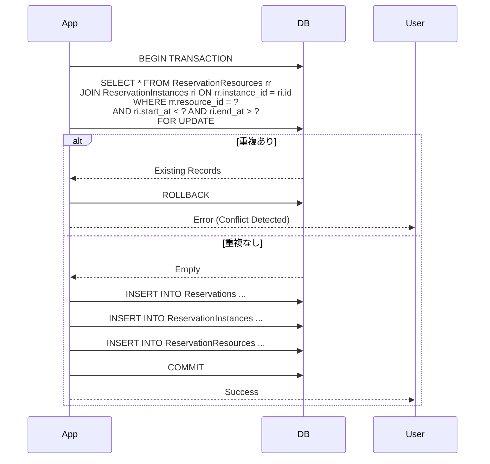
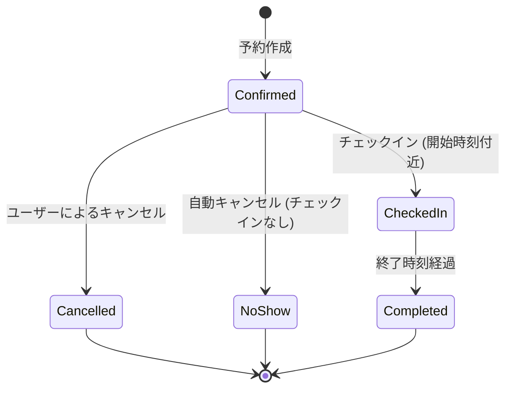

# スケジュール・リソース管理詳細設計書

**対象機能:** FN-02 (予定管理), FN-03 (リソース予約), FN-07 (チェックイン), FN-11 (キャンセルポリシー)

## 1. はじめに
本ドキュメントは、ESMSの中核となるスケジュール管理およびリソース予約機能の詳細設計を記述する。
特に、データの整合性を保証する排他制御と、複雑な繰り返し予定の取り扱いについて重点的に定義する。

## 2. データモデル詳細

### 2.1 物理データモデル (Schema Definition)

#### Reservations (予約基本テーブル)
予定の親データを管理する。繰り返し予定の場合は、そのルール (RRULE) を保持する。

| Column | Type | Constraints | Description |
| :--- | :--- | :--- | :--- |
| `id` | UUID | PK | 予約ID |
| `organizer_id` | UUID | FK(Users) | 主催者ID |
| `title` | VARCHAR(255) | NOT NULL | 件名 |
| `description` | TEXT | | 詳細説明 |
| `start_at` | TIMESTAMPTZ | NOT NULL | 開始日時 (UTC) |
| `end_at` | TIMESTAMPTZ | NOT NULL | 終了日時 (UTC) |
| `rrule` | VARCHAR(255) | | 繰り返しルール (iCalendar形式) |
| `is_private` | BOOLEAN | DEFAULT FALSE | 非公開フラグ |

#### ReservationInstances (予約インスタンス展開テーブル)
検索性能向上のため、繰り返し予定を個別のインスタンスとして展開して格納する。
単発予定もここに含まれる（1対1対応）。

| Column | Type | Constraints | Description |
| :--- | :--- | :--- | :--- |
| `id` | UUID | PK | インスタンスID |
| `reservation_id` | UUID | FK(Reservations) | 親予約ID |
| `start_at` | TIMESTAMPTZ | NOT NULL | インスタンス開始日時 |
| `end_at` | TIMESTAMPTZ | NOT NULL | インスタンス終了日時 |
| `original_start_at` | TIMESTAMPTZ | | 繰り返し例外時の元の開始日時 |
| `status` | VARCHAR(20) | | CONFIRMED, CANCELLED |

#### ReservationResources (リソース予約テーブル)
予約とリソース（会議室・備品）の多対多関係を管理する。排他制御の対象となる。

| Column | Type | Constraints | Description |
| :--- | :--- | :--- | :--- |
| `reservation_instance_id` | UUID | FK(Instances) | 予約インスタンスID |
| `resource_id` | UUID | FK(Resources) | リソースID |

#### ReservationParticipants (参加者テーブル)
| Column | Type | Constraints | Description |
| :--- | :--- | :--- | :--- |
| `reservation_instance_id` | UUID | FK(Instances) | 予約インスタンスID |
| `user_id` | UUID | FK(Users) | 参加者ID |
| `status` | VARCHAR(20) | | NEEDS_ACTION, ACCEPTED, DECLINED |

## 3. 排他制御 (Conflict Resolution)

### 3.1 重複検知ロジック
リソース予約時の重複チェックは、以下の条件で行う。
`ExistingStart < NewEnd AND ExistingEnd > NewStart`

### 3.2 予約シーケンス (Pessimistic Locking)
データベースのトランザクション分離レベルは `READ COMMITTED` 以上とし、`SELECT FOR UPDATE` を用いて対象リソースの時間枠をロックする。

## 4. 繰り返し予定 (Recurrence)

### 4.1 ハイブリッド展開戦略
検索パフォーマンスとデータ管理のバランスを取るため、以下の戦略を採用する。

1.  **Master Data:** `Reservations` テーブルに RRULE を保存。これが正 (Source of Truth)。
2.  **Expansion:** 予約作成・更新時に、直近 **2年分** のインスタンスを計算し、`ReservationInstances` テーブルに物理レコードとして保存する。
3.  **Batch Job:** 毎日夜間にバッチを実行し、展開期間が常に2年先まで維持されるように追加展開を行う。

### 4.2 例外 (Exception) の扱い
繰り返し予定のうち、特定の日だけ時間を変更したりキャンセルする場合：
1.  対象の `ReservationInstances` レコードを更新する。
2.  `original_start_at` カラムに、本来の開始日時を記録し、RRULE上のどの日付に対応するかを紐付ける。
3.  親の `Reservations` テーブルには変更を加えない（RRULEは変わらないため）。

## 5. 状態遷移 (State Machine)

予約のライフサイクルとステータス遷移を以下に定義する。

### 5.2 予約ステートマシン
予約データのライフサイクルを管理するステータス遷移。

*   **Pending (承認待ち):** 承認フローが必要な会議の初期状態。リソースは仮押さえ。
*   **Confirmed (確定):** 正常に予約が完了した状態。
*   **Cancelled (キャンセル):** ユーザーまたはシステムにより取り消された状態。
*   **CheckedIn (利用中):** チェックイン済み。
*   **Completed (完了):** 予定終了時刻を過ぎ、正常終了した状態。
*   **NoShow (無断キャンセル):** チェックインされずに終了時刻を過ぎた状態。

## 6. キャンセルポリシー (Cancellation Policy)

### 6.1 ポリシー定義
*   **Free Cancellation:** 開始24時間前までのキャンセルはペナルティなし。
*   **Late Cancellation:** 開始24時間以内のキャンセルは、警告を表示し、ログに記録する。
*   **No Show:** チェックインなしで終了した場合、ペナルティスコアを加算する。

### 6.2 処理ロジック
1.  ユーザーがキャンセル操作を実行。
2.  `CurrentTime` と `Reservation.StartAt` の差分を計算。
3.  `Diff < 24h` の場合:
    -   警告モーダルを表示: "開始24時間を切っています。部署への請求対象となる可能性があります。"
    -   ユーザーが「同意してキャンセル」を選択した場合のみ実行。
    -   `AuditLogs` に `Action: CANCEL_WITH_PENALTY` を記録。
