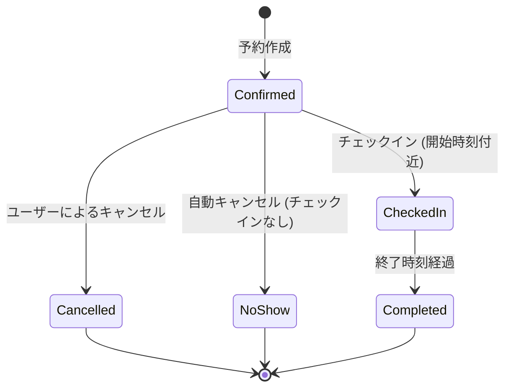

<!--
Depends On: docs/basic_design.md
Depended On By: None
-->
# スケジュール・リソース管理詳細設計書

**対象機能:** FN-02 (予定管理), FN-03 (リソース予約), FN-07 (チェックイン), FN-11 (キャンセルポリシー)

## 1. はじめに
本ドキュメントは、ESMSの中核となるスケジュール管理およびリソース予約機能の詳細設計を記述する。
特に、データの整合性を保証する排他制御と、複雑な繰り返し予定の取り扱いについて重点的に定義する。

## 2. データモデル詳細

### 2.1 物理データモデル (Schema Definition)

#### Reservations (予約基本テーブル)
予定の親データを管理する。繰り返し予定の場合は、そのルール (RRULE) を保持する。

| Column | Type | Constraints | Description |
| :--- | :--- | :--- | :--- |
| `id` | UUID | PK | 予約ID |
| `organizer_id` | UUID | FK(Users) | 主催者ID |
| `title` | VARCHAR(255) | NOT NULL | 件名 |
| `description` | TEXT | | 詳細説明 |
| `start_at` | TIMESTAMPTZ | NOT NULL | 開始日時 (UTC) |
| `end_at` | TIMESTAMPTZ | NOT NULL | 終了日時 (UTC) |
| `rrule` | VARCHAR(255) | | 繰り返しルール (iCalendar形式) |
| `is_private` | BOOLEAN | DEFAULT FALSE | 非公開フラグ |
| `timezone` | VARCHAR(50) | DEFAULT 'Asia/Tokyo' | タイムゾーン |
| `updated_by` | UUID | FK(Users) | 最終更新者 |
| `version` | INT | DEFAULT 1 | 楽観的ロック用バージョン |
| `deleted_at` | TIMESTAMPTZ | | 論理削除日時 |

#### ReservationInstances (予約インスタンス展開テーブル)
検索性能向上のため、繰り返し予定を個別のインスタンスとして展開して格納する。
単発予定もここに含まれる（1対1対応）。

| Column | Type | Constraints | Description |
| :--- | :--- | :--- | :--- |
| `id` | UUID | PK | インスタンスID |
| `reservation_id` | UUID | FK(Reservations) | 親予約ID |
| `start_at` | TIMESTAMPTZ | NOT NULL | インスタンス開始日時 |
| `end_at` | TIMESTAMPTZ | NOT NULL | インスタンス終了日時 |
| `original_start_at` | TIMESTAMPTZ | | 繰り返し例外時の元の開始日時 |
| `status` | VARCHAR(20) | | CONFIRMED, CANCELLED |

#### ReservationResources (リソース予約テーブル)
予約とリソース（会議室・備品）の多対多関係を管理する。排他制御の対象となる。

| Column | Type | Constraints | Description |
| :--- | :--- | :--- | :--- |
| `reservation_instance_id` | UUID | FK(Instances) | 予約インスタンスID |
| `resource_id` | UUID | FK(Resources) | リソースID |

#### ReservationParticipants (参加者テーブル)
| Column | Type | Constraints | Description |
| :--- | :--- | :--- | :--- |
| `reservation_instance_id` | UUID | FK(Instances) | 予約インスタンスID |
| `user_id` | UUID | FK(Users) | 参加者ID |
| `status` | VARCHAR(20) | | NEEDS_ACTION, ACCEPTED, DECLINED |

## 3. 排他制御 (Conflict Resolution)

### 3.1 重複検知ロジック
リソース予約時の重複チェックは、以下の条件で行う。
`ExistingStart < NewEnd AND ExistingEnd > NewStart`

### 3.2 排他制御詳細実装 (Detailed Conflict Resolution)

#### 3.2.1 ロック戦略
**ダブルブッキング絶対回避**のため、以下の厳密な排他制御を実装する：

- **分離レベル**: `SERIALIZABLE`（最高レベルの整合性保証）
- **ロック粒度**: リソースID × 時間範囲の組み合わせ
- **ロック順序**: リソースIDの昇順（デッドロック回避）

#### 3.2.2 排他制御アルゴリズム設計

##### 処理フロー設計
1. **前処理**: リソースIDを昇順でソート（デッドロック回避）
2. **ロック取得**: 対象リソースに対して順次ロック取得
3. **競合チェック**: 時間重複する既存予約の検索
4. **競合判定**: 重複が発見された場合の処理分岐
5. **代替案検索**: 競合時の代替リソース・時間帯の提案
6. **予約確定**: 競合がない場合の予約レコード作成

##### データ構造設計
- **入力データ**: 予約リクエスト（開始時刻、終了時刻、リソースID配列、参加者情報）
- **中間データ**: 競合情報（競合リソースID、競合時間帯、既存予約ID）
- **出力データ**: 予約確定結果または競合エラー（代替案含む）

##### 競合検出ロジック
- **検索条件**: `existing_start < new_end AND existing_end > new_start`
- **対象ステータス**: `CONFIRMED` 状態の予約のみ
- **ロック方式**: `FOR UPDATE NOWAIT` による即座のロック取得

##### 代替案生成ロジック
- **時間帯調整**: ±30分、±1時間の時間帯で再検索
- **リソース変更**: 同等設備を持つ他のリソースを検索
- **優先度**: 元の条件に近い順で最大3件を提案

#### 3.2.3 エラーハンドリング設計

##### エラー分類と対応方針
| エラー種別 | 発生条件 | 対応方針 | ユーザー表示 |
| :--- | :--- | :--- | :--- |
| **ロックタイムアウト** | 5秒以内にロック取得失敗 | 指数バックオフでリトライ | 「他のユーザーが予約処理中です。しばらくお待ちください」 |
| **デッドロック** | 複数トランザクションの循環待機 | 即座にリトライ | 「処理が混雑しています。再試行中...」 |
| **時間重複** | 既存予約との競合 | 代替案を提示 | 「選択した時間は既に予約されています。代替案をご確認ください」 |
| **権限不足** | リソースアクセス権限なし | エラー返却（リトライなし） | 「このリソースを予約する権限がありません」 |

##### リトライ戦略設計
- **最大試行回数**: 3回
- **バックオフ間隔**: 100ms → 200ms → 400ms（指数バックオフ）
- **リトライ対象**: ロックタイムアウト、デッドロックのみ
- **リトライ除外**: 権限エラー、バリデーションエラー

#### 3.2.4 パフォーマンス監視設計

##### 監視指標定義
| 指標名 | 測定対象 | 目標値 | アラート閾値 |
| :--- | :--- | :--- | :--- |
| **ロック保持時間** | トランザクション開始〜終了 | 平均200ms以下 | 500ms超過が5%以上 |
| **デッドロック発生率** | 全予約処理に対する割合 | 0.1%以下 | 0.5%超過 |
| **競合発生率** | 予約試行に対する競合の割合 | 5%以下 | 15%超過 |
| **代替案提示成功率** | 競合時の代替案発見率 | 80%以上 | 60%未満 |

##### ログ設計
- **成功ログ**: 予約ID、処理時間、使用リソース
- **競合ログ**: 競合リソース、競合時間帯、代替案の有無
- **エラーログ**: エラー種別、リトライ回数、最終結果
- **パフォーマンスログ**: ロック取得時間、DB応答時間、全体処理時間

## 4. 繰り返し予定 (Recurrence)

### 4.1 ハイブリッド展開戦略
検索パフォーマンスとデータ管理のバランスを取るため、以下の戦略を採用する。

1.  **Master Data:** `Reservations` テーブルに RRULE を保存。これが正 (Source of Truth)。
2.  **Expansion:** 予約作成・更新時に、直近 **2年分** のインスタンスを計算し、`ReservationInstances` テーブルに物理レコードとして保存する。
3.  **Batch Job:** 毎日夜間にバッチを実行し、展開期間が常に2年先まで維持されるように追加展開を行う。

### 4.2 例外 (Exception) の扱い
繰り返し予定のうち、特定の日だけ時間を変更したりキャンセルする場合：
1.  対象の `ReservationInstances` レコードを更新する。
2.  `original_start_at` カラムに、本来の開始日時を記録し、RRULE上のどの日付に対応するかを紐付ける。
3.  親の `Reservations` テーブルには変更を加えない（RRULEは変わらないため）。

## 5. 状態遷移 (State Machine)

予約のライフサイクルとステータス遷移を以下に定義する。

### 5.2 予約ステートマシン
予約データのライフサイクルを管理するステータス遷移。

*   **Pending (承認待ち):** 承認フローが必要な会議の初期状態。リソースは仮押さえ。
*   **Confirmed (確定):** 正常に予約が完了した状態。
*   **Cancelled (キャンセル):** ユーザーまたはシステムにより取り消された状態。
*   **CheckedIn (利用中):** チェックイン済み。
*   **Completed (完了):** 予定終了時刻を過ぎ、正常終了した状態。
*   **NoShow (無断キャンセル):** チェックインされずに終了時刻を過ぎた状態。

## 6. キャンセルポリシー (Cancellation Policy)

### 6.1 ポリシー定義
*   **Free Cancellation:** 開始24時間前までのキャンセルはペナルティなし。
*   **Late Cancellation:** 開始24時間以内のキャンセルは、警告を表示し、ログに記録する。
*   **Penalty Score:** Late Cancellation 1回につきスコア+1。スコアは90日でローテーション（消滅）する。
*   **High Risk Alert:** スコアが3以上になった場合、管理者にアラート通知を送る。
*   **Restriction:** スコアが5以上になった場合、新規予約を制限（承認必須化）する。

### 6.2 処理ロジック
1.  ユーザーがキャンセル操作を実行。
2.  `CurrentTime` と `Reservation.StartAt` の差分を計算。
3.  `Diff < 24h` の場合:
    -   警告モーダルを表示: "開始24時間を切っています。ペナルティスコアが加算されます。"
    -   ユーザーが「同意してキャンセル」を選択した場合のみ実行。
    -   `AuditLogs` に `Action: CANCEL_WITH_PENALTY` を記録。
    -   ユーザーのペナルティスコアを再計算し、閾値を超えた場合は管理者通知または制限フラグを更新。

### 6.3 スコア活用箇所 (API/UI連携)
-   **ユーザープロファイルAPI:** `GET /api/v1/users/me` で `penaltyScore` と `penaltyScoreExpireAt` を返却し、管理画面で閲覧可能にする（管理者は将来的に `/api/v1/users/{userId}` で閲覧）。
-   **予約作成API:** `POST /api/v1/events` のリクエスト処理時に `penaltyScore >= 5` の場合は `requiresManagerApproval=true` を強制セットし、レスポンスにも同フラグを含める。
-   **UI表示:** 予約フォームにスコアが閾値に近い場合（例: 4以上）、「遅刻・キャンセルが多いため承認が必要になる可能性があります」といった警告バナーを表示する。

## 7. API/DTO 詳細 (基本設計反映)
基本設計の 5.3 節に準拠し、スケジュール・リソース系 API の詳細仕様とバリデーションを本詳細設計に反映する。

### 7.1 エンドポイント

| エンドポイント | 用途 | 主なクエリ/ヘッダー | レスポンス概要 |
| :--- | :--- | :--- | :--- |
| `GET /api/v1/events` | 指定期間の予定・リソース使用状況の取得 | `startAt`, `endAt`（必須）、`resources[]`, `limit`, `cursor`, `sort`, `fields`。ヘッダーに `Authorization`, `X-Request-Id`。 | `items[]` に予約サマリ、`nextCursor` でページ継続。 |
| `POST /api/v1/events` | 予定・リソースの作成 | Body は 7.2 参照。`Idempotency-Key` ヘッダーを推奨。 | `eventId`, `conflict`, `approvalStatus`, `createdAt` を返す。 |
| `GET /api/v1/events/{eventId}` | 予定詳細の取得 | `fields` で返却項目を限定可能。 | 予約・参加者・リソース・RRULE を返す。 |
| `PATCH /api/v1/events/{eventId}` | 予定更新 | `If-Match: <version>` で楽観ロック。 | 更新後の `approvalStatus` と `updatedAt` を返す。 |

### 7.2 DTO スキーマ（主要項目）
- **EventCreateRequest**
    - `title` (string, required, max 200)
    - `startAt` (string, ISO8601, required)
    - `endAt` (string, ISO8601, required)
    - `timezone` (IANA tz, default `Asia/Tokyo`)
    - `resources[]` (object): `resourceId` (string, required), `required` (bool, default true)
    - `participants[]` (object): `userId` (string, required), `role` (`organizer|attendee|approver`), `status` (`NeedsAction` 初期)
    - `recurrence` (object, optional): `rrule` (RFC 5545, required), `until` (ISO8601|null)
    - `allowProxy` (bool, default false)
    - `notes` (string, max 2000)

- **EventSummary**
    - `eventId`, `title`, `startAt`, `endAt`, `isPrivate`, `resources[] { resourceId, name }`, `approvalStatus`, `conflict` (bool)

- **EventDetail**
    - `EventSummary` に加え、`participants[] { userId, role, status }`, `recurrence`, `allowProxy`, `notes`, `updatedAt`

### 7.3 バリデーション/エラー取り扱い
- `startAt < endAt` かつ最大12時間。過去時刻の作成は拒否。
- `recurrence` は `COUNT` または `UNTIL` が必須、展開上限200インスタンス。例外が多い場合は `409 CONFLICT` を返却。
- リソース重複時は `409 CONFLICT` として `conflictDetails[] { resourceId, startAt, endAt }` をレスポンスに含める。
- スキーマ違反は `400 VALIDATION_ERROR` とし、`errors[] { field, message }` と `traceId` を返却。

## 8. パフォーマンス・スケーラビリティ設計

### 8.1 読み取り負荷分散 (Read Replica Stickiness)
*   予約作成・更新直後のデータ不整合を防ぐため、更新操作を行ったユーザーからの読み取りリクエストは、**60秒間** プライマリDBへルーティングする（Sticky Session / Cookie制御）。
*   それ以外の参照リクエストはリードレプリカへ振り分け、負荷を分散する。

### 8.2 キャッシュ戦略 (Redis)
*   **整合性優先:** 予約枠の空き状況確認など、厳密な整合性が求められる処理はキャッシュをバイパスする。
*   **参照系キャッシュ:** 予定詳細やカレンダー表示用データはRedisにキャッシュし、TTLは **5〜15分** とする。
*   **無効化:** 予約更新時に、関連するキャッシュ（ユーザーのカレンダービュー等）を非同期ジョブで無効化する。
