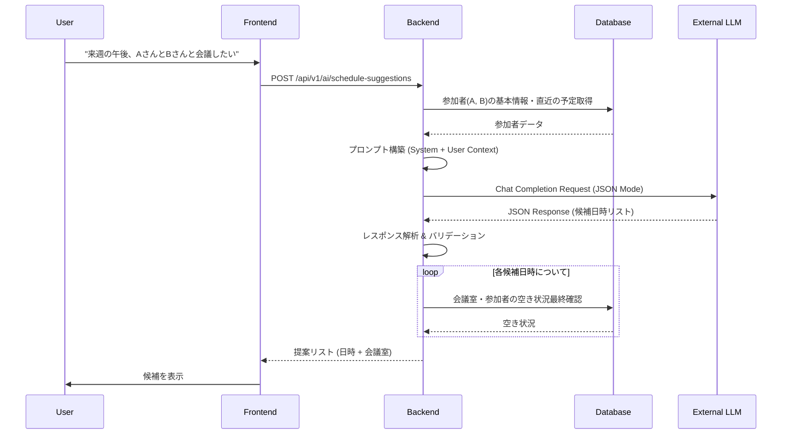

# AIアシスタント機能詳細設計書

**対象機能:** FN-04 (AI日程調整), FN-09 (会議準備支援)

## 1. はじめに
本ドキュメントは、生成AIを活用したスマート日程調整機能の詳細設計を記述する。
本機能は、ユーザーの自然言語による指示を解析し、最適な会議候補日時とリソース（会議室等）を提案するものである。

## 2. アーキテクチャ詳細

### 2.1 コンポーネント構成
AI機能は、Backend Server内の `AIService` モジュールが集約して担当する。

- **Frontend**: ユーザーからの自然言語入力を受け付け、Backendへ送信。候補提示後のユーザー選択を処理。
- **Backend (AIService)**:
    - **Prompt Builder**: ユーザー入力とコンテキスト（現在日時、参加者情報など）からプロンプトを構築。
    - **LLM Client**: 外部LLM API (OpenAI/Gemini) との通信。
    - **Parser/Validator**: LLMからのレスポンス（JSON）を解析・検証。
    - **Resource Searcher**: 解析結果（日時・参加者）に基づき、実際の空き状況をDBに問い合わせる（RAG的な挙動）。

### 2.2 シーケンス図 (LLM通信フロー)



## 3. プロンプトエンジニアリング設計

### 3.1 システムプロンプト構成
LLMには「優秀な秘書」としてのロールを与え、常にJSON形式で出力するように指示する。

**System Prompt テンプレート:**
```text
You are an intelligent scheduling assistant for the Enterprise Schedule Management System (ESMS).
Your goal is to extract scheduling intent from the user's natural language input.

Current Time: {{current_time}}
Requester: {{user_name}} (ID: {{user_id}})

Instructions:
1. Analyze the user's input to identify:
   - Participants (names, emails)
   - Date/Time constraints (e.g., "next week", "tomorrow afternoon")
   - Duration (default to 60 minutes if not specified)
   - Topic/Title (if specified)
   - Resource requirements (e.g., "large room", "projector")

2. Output MUST be a valid JSON object adhering to the specified schema.
3. Do NOT include any conversational text outside the JSON.
4. If the intent is unclear, return a JSON with "error" field explaining what is missing.
```

### 3.2 JSON出力スキーマ
LLMからのレスポンスは以下のJSON構造を強制する。

```json
{
  "intent": "schedule_meeting",
  "candidates": [
    {
      "start_range_start": "YYYY-MM-DDTHH:MM:00",
      "start_range_end": "YYYY-MM-DDTHH:MM:00",
      "duration_minutes": 60,
      "participants": ["Name A", "Name B"],
      "resources": ["meeting_room"],
      "title_suggestion": "Meeting with Name A and Name B"
    }
  ],
  "reasoning": "User requested next week afternoon..."
}
```

## 4. コンテキスト管理

### 4.1 注入するコンテキスト情報
精度向上のため、以下の情報をプロンプトに動的に埋め込む。

1.  **現在日時 (Current Time)**: 相対日時（「明日」「来週」）の解決に必須。
2.  **ユーザー情報**: 依頼者の氏名、部署。
3.  **頻出参加者リスト (Optional)**: ユーザーがよく会議する相手のリスト（同姓同名の解決用）。

### 4.2 会話履歴
本バージョンでは、**1ターン完結型**（ステートレス）とし、複雑な会話ラリーは行わない。
ユーザーが条件を変更して再検索する場合は、クライアント側で条件を付加して再度リクエストを送る。

## 5. レスポンス解析とエラーハンドリング

### 5.1 バリデーションロジック
1.  **JSON構文チェック**: パースエラー時はリトライ（最大1回）またはエラー返却。
2.  **スキーマチェック**: 必須フィールド（`candidates`, `duration_minutes` 等）の存在確認。
3.  **論理チェック**:
    - 開始日時が過去でないか。
    - 終了日時が開始日時より後か。

### 5.2 Hallucination対策
-   LLMが提案した「空き時間」はあくまで「ユーザーの意図から抽出した希望時間」として扱い、**必ずDBの正データと突き合わせて最終的な空き状況を確認する**。

## 6. 会議準備支援 (Meeting Prep Suggestion)

### 6.1 機能概要
予定のタイトルや参加者情報を解析し、会議に必要なドキュメント（議事録、テンプレート）をレコメンドする。

### 6.2 処理フロー (RAG)
1.  **Trigger**: ユーザーが予定詳細画面を開く、または予定作成時にタイトルを入力してフォーカスアウトする。
2.  **Search**:
    -   `Title` からキーワードを抽出（例: "予算", "定例", "1on1"）。
    -   `Participants` の部署・役職情報を取得。
    -   社内ドキュメントストア（Vector DB）を検索。
3.  **Filter**:
    -   権限フィルタ: ユーザーが閲覧権限を持たないドキュメントを除外。
    -   鮮度フィルタ: 直近1年以内のドキュメントを優先。
4.  **Suggest**:
    -   「過去の関連議事録: 3件」
    -   「推奨テンプレート: 予算案フォーマット」
    -   これらをサイドパネルまたはポップオーバーで提示。

### 6.3 プロンプト例
```text
Analyze the meeting title "{{title}}" and participants "{{participants}}".
Identify the meeting type (e.g., Decision Making, Brainstorming, Reporting) and suggest 3 relevant document keywords for searching the knowledge base.
```

